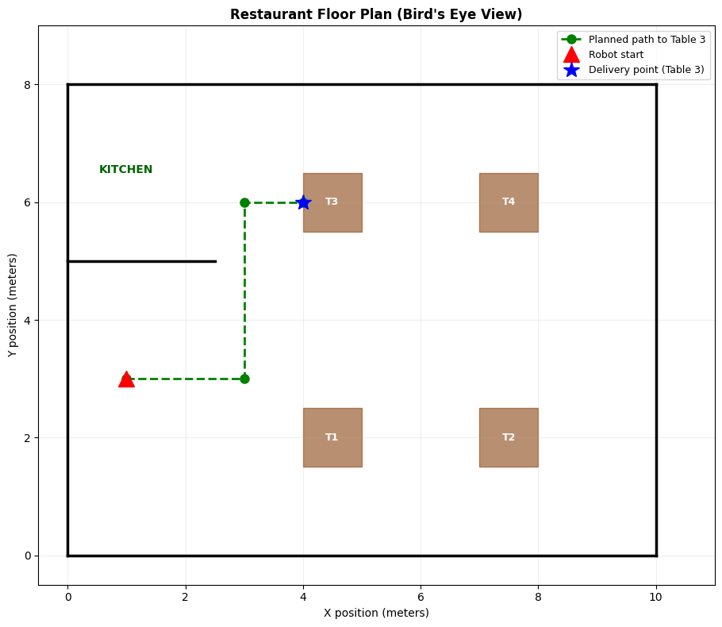
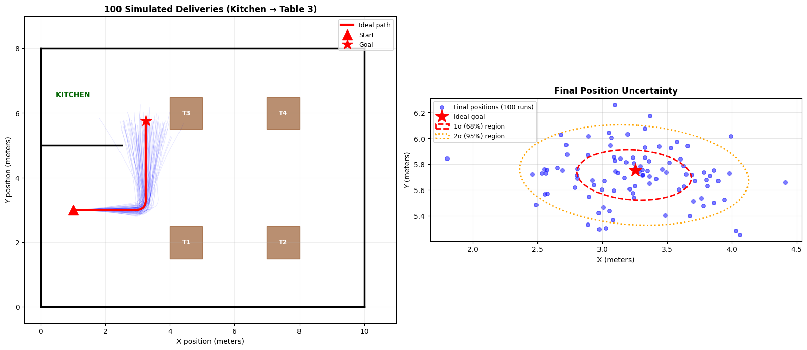
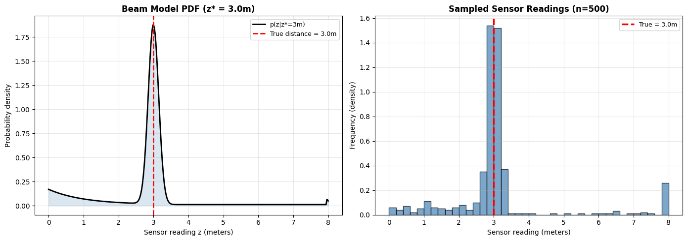
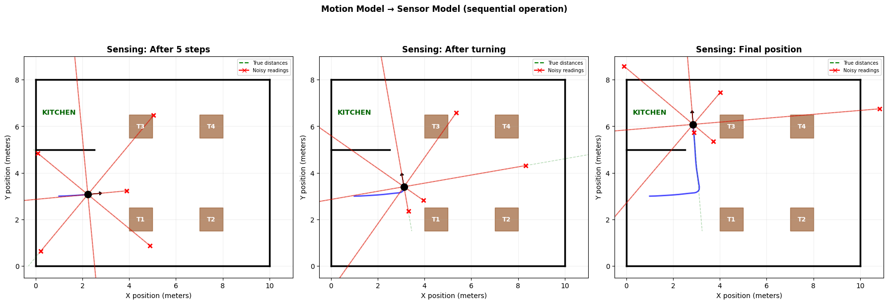
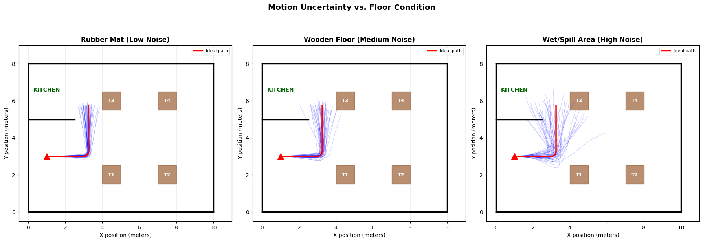

# AIML ZG528 – Assignment 1: Probabilistic Motion & Sensor Models
## Part A – Written Report (Questions 1 & 3)

| | |
|---|---|
| **Domain** | Hospitality Bots (Restaurant Food Delivery) |
| **Date** | 8 May 2026 |

**Group Members:**

| Name | BITS ID |
|------|--------|
| Ayushi Gupta | 2024AC05720 |

---

## Question 1: Robot System Description

### a) Type of Robot, Function, and Working Environment

**Robot Type:**

The robot is an Autonomous Mobile Robot (AMR) built on a compact wheeled differential-drive platform. It is specifically designed for navigating indoor restaurant environments where space is limited and people are constantly moving around.

**Function:**

The robot's primary job is to autonomously deliver food plates and beverages from the kitchen counter to the correct dining table. During each delivery, it must:

1. Pick up the prepared food order from the kitchen pass/counter
2. Navigate through the dining area, avoiding tables and chairs, to reach the assigned table number
3. Detect and avoid dynamic obstacles such as waiters walking, guests standing up, or chairs being pulled out

**Working Environment:**

The restaurant floor is approximately 10m × 8m in size. It has a kitchen area on one side and a dining area with 4 tables on the other. The environment presents several challenges:

- **Obstacle types:** Waiters move unpredictably, guests stand or sit without warning, chairs get pushed into walkways, and liquids may be spilled on the floor
- **Floor surface variation:**
  - Kitchen area has rubber mats (good wheel grip, low motion noise)
  - Dining area has wooden/tile flooring (moderate grip)
  - Spill zones have wet surfaces (poor grip, high wheel slippage)
- **Safety constraints:** The robot must never collide with a person or furniture, must not spill the food it carries, and must operate quietly so as not to disturb diners

---

### b) Sensor Selection and Justification

**Proprioceptive Sensors (internal state measurement):**

| # | Sensor | What it measures | Why it is needed |
|---|--------|-----------------|------------------|
| 1 | Wheel Encoders (Optical Rotary) | Wheel rotations → distance & heading | Dead-reckoning (no GPS indoors); provides velocity inputs (v, ω) for motion model |
| 2 | IMU (Gyroscope + Accelerometer) | Angular velocity & linear acceleration | Corrects odometry drift during turns; compensates for wheel slip on wet floors (α₅, α₆ parameters) |

**Exteroceptive Sensors (external environment measurement):**

| # | Sensor | What it measures | Why it is needed |
|---|--------|-----------------|------------------|
| 1 | 2D LiDAR (RPLIDAR A2, 360°) | Range to obstacles | Detects walls, table legs, chairs, moving people; modeled by beam sensor (p_hit, p_short, p_max, p_rand) |
| 2 | RGB-D Camera (Intel RealSense D435) | Color image + depth | Table number recognition, guest detection, close-range obstacle avoidance at ground level |

---

## Question 2: Motion Model Implementation

**Refer to:** `Part_A_Motion_Model.ipynb` (attached Jupyter Notebook)

---

### 2.1 Restaurant Environment Setup

The robot operates in a 10m × 8m restaurant with walls, a kitchen counter, and 4 dining tables modeled as obstacles.

**Explanation:** The floor plan shows the bird's-eye view of the environment. The green dashed line is the planned delivery path from the kitchen (red triangle) to Table 3 (blue star). Walls and table boundaries are used for ray-casting in the sensor model.

---

### 2.2 Velocity-Based Motion Model

The motion model takes commanded velocities (v, ω) and adds Gaussian noise controlled by 6 parameters (α₁–α₆) to simulate real-world imperfections like wheel slip and motor imprecision. The robot's new pose is computed using circular-arc kinematics.

---

### 2.3 Monte Carlo Trajectory Simulation

We ran 100 simulated deliveries with the same commands but different noise realizations. This demonstrates how uncertainty accumulates over time.

**Explanation:**
- **Left plot:** All 100 noisy paths (blue) overlaid on the restaurant map. The red line shows the ideal (noise-free) path. Notice the paths spread apart as the robot moves further — uncertainty grows with distance.
- **Right plot:** Scatter of final delivery positions. The red dashed ellipse (1σ) contains ~68% of endpoints; the orange dotted ellipse (2σ) contains ~95%. This quantifies how uncertain the robot is about where it ends up.

---

### 2.4 Beam-Based Sensor Model

The LiDAR sensor model is a 4-component mixture: hit (Gaussian around true distance), short (unexpected obstacle), max (no return), and random (glitch). We tested with a true wall distance of 3.0m.

**Explanation:**
- **Left:** The probability distribution p(z|z*=3m). The sharp peak at z=3m is the hit component — most readings are correct. The elevated region at z<3m represents short readings (something blocking the beam). The small uniform baseline is the random component.
- **Right:** Histogram of 500 actual sensor samples. Most cluster around 3m (accurate), but some scatter to lower values (obstacles) or near 8m (max range / random noise).

---

### 2.5 Combined Motion + Sensing

The robot first moves (motion model adds position noise), then senses from its actual (noisy) position. We show 8 LiDAR beams at 3 points along the delivery.

**Explanation:** At each sensing position, green dashed lines show true distances to walls, and red solid lines show what the noisy sensor actually reports. The discrepancy between green and red illustrates that the robot has two sources of uncertainty — it doesn't know exactly where it is AND its sensor readings aren't exact.

---

### 2.6 Floor Condition Effect on Motion Noise

Different floor surfaces produce different noise levels. We compare 50 trajectories under three conditions.

**Explanation:**
- **Rubber mat (kitchen):** Very tight clustering around the ideal path — minimal uncertainty
- **Wooden floor (dining area):** Moderate spread — robot generally stays on course but with some deviation
- **Wet/spill area:** Large spread — robot could miss the target table entirely, highlighting why probabilistic planning is critical on slippery surfaces

---

## Question 3: Workplace Evaluation 

**Motion Model Benefits:**
- Accounts for real-world uncertainties:
  - Wheel slippage on wet kitchen floors
  - Drift when turning between tightly spaced dining tables
- Enables more robust path execution than a simple deterministic model

**Sensor Model Benefits:**
- Reliable obstacle detection via 4-component mixture:
  - Handles unexpected obstacles (waiter stepping in, chair pulled out)
  - Accounts for random noise and max-range readings in open areas

**Safety Enhancement:**
- Reduces collision probability with guests and furniture
- Robot "knows" it might be slightly off-course and plans accordingly

**Productivity Impact:**
- ~20–30 deliveries per service shift
- Follows probabilistic paths → less manual intervention needed

**Workplace Value:**
- Reduces wait staff workload for routine food runs by ~40%
- Servers focus on guest interactions
- Robot handles repetitive kitchen-to-table deliveries reliably

---
