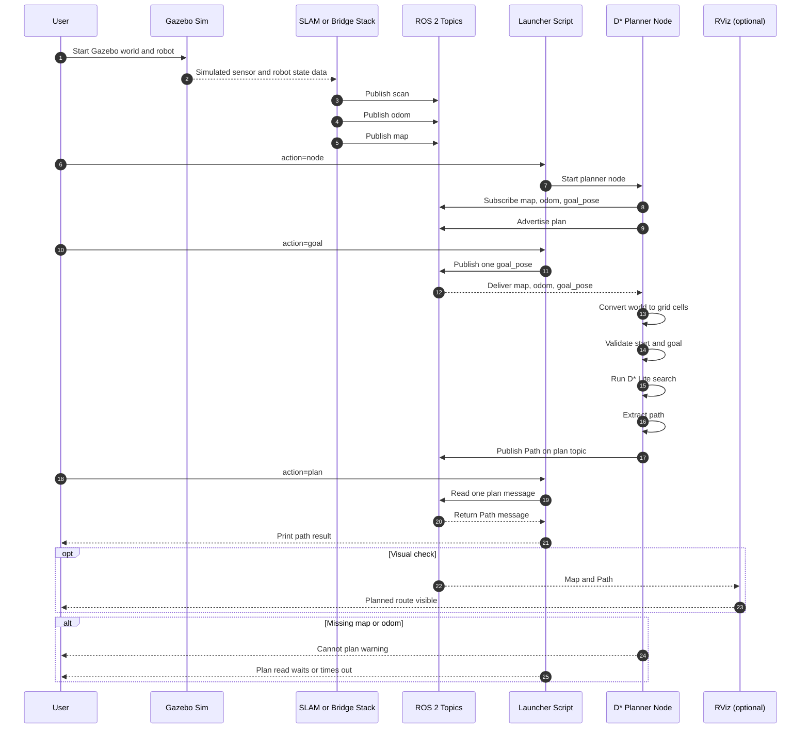

# Group2 Assignment 2 Wiki (Easy Read + Viva Ready)

This wiki explains the notebook in simple language so any team member can quickly understand the pipeline and present it clearly in viva.

## Quick Index (Clickable)

1. [Problem in One Line](#1-problem-in-one-line)
2. [Run Order and Dependencies](#2-run-order-and-dependencies)
3. [Module-by-Module Explanation](#3-module-by-module-explanation)
4. [Formula Cheat Sheet (Plain Language)](#4-formula-cheat-sheet-plain-language)
5. [What Changed in Simplification](#5-what-changed-in-simplification)
6. [Common Viva Questions (Short Answers)](#6-common-viva-questions-short-answers)
7. [ROS 2 + Gazebo Execution Steps (Linux / VLab)](#7-ros-2--gazebo-execution-steps-linux--vlab)
8. [Quick Troubleshooting Flow](#8-quick-troubleshooting-flow-based-on-actual-lab-issues)
9. [Sequence Diagram of Complete Workflow](#9-sequence-diagram-of-complete-workflow)
10. [UI Monitoring Dashboard (Recommended)](#10-ui-monitoring-dashboard-recommended)

Useful jump links inside Section 7:
- [A) Understand Gazebo vs ROS 2](#a-understand-gazebo-vs-ros-2)
- [B) Start Gazebo](#b-start-gazebo)
- [C) Run Planner with One Script](#c-run-planner-with-one-script)
- [C1) One-Click Full Automation (Recommended)](#c1-one-click-full-automation-recommended)
- [D) Other Useful Script Actions](#d-other-useful-script-actions)
- [E) Topic Readiness Check](#e-topic-readiness-check)
- [F) RViz Screenshot for Submission](#f-rviz-screenshot-for-submission)
- [G) Common Issues](#g-common-issues)

---

## 1) Problem in One Line

Build a complete navigation stack for a restaurant robot:

1. localize itself,
2. build/update a map,
3. plan and replan path,
4. improve exploration decisions with RL,
5. test a deep-learning planner as a replacement for classical planning.

---

## 2) Run Order and Dependencies

Run the notebook top to bottom. Later parts depend on earlier outputs.

1. Setup creates shared map and utility variables.
2. Part A uses Setup map for localization.
3. Part B builds learned occupancy map.
4. Part C uses learned map for D* planning.
5. Part D uses same ray model and map conventions for RL exploration.
6. Part E learns to imitate Part C planner behavior.

Key shared variables:

- grid
- learned_grid
- RES, W, H
- start_xy, goal_xy
- start_rc, goal_rc

---

## 3) Module-by-Module Explanation

## Part 0: Setup

Purpose:
- Build one consistent restaurant map for all experiments.

Input:
- map size, walls, counter, table locations.

Output:
- occupancy grid, start position, goal position, plotting helper.

Why it matters:
- Fair comparison is possible only when all methods use the same world.

---

## Part A: Monte Carlo Localization (MCL)

Purpose:
- Estimate robot pose on a known map.

Input:
- control sequence and simulated LiDAR measurements.

Output:
- estimated path and position error curve.

Flow:
1. Predict particle states from noisy motion model.
2. Compute scan-likelihood weights.
3. Estimate pose from weighted particles.
4. Resample particles.
5. Repeat each step in trajectory.

Interpretation:
- If average error is low, localization is reliable enough for delivery tasks.

---

## Part B: Grid SLAM (Occupancy Mapping)

Purpose:
- Reconstruct map from repeated beam scans.

Input:
- waypoints and raycast sensor model.

Output:
- occupancy probability map, thresholded map, IoU vs ground truth.

Flow:
1. Follow lawnmower-style waypoints.
2. Cast beams around robot.
3. Add free evidence along beam path.
4. Add occupied evidence at beam hit point.
5. Convert log-odds to probabilities and threshold.

Interpretation:
- Higher IoU means learned map is closer to true environment.

---

## Part C: D* Lite Path Planning (Simplified)

Purpose:
- Plan shortest route and replan fast after obstacle updates.

Input:
- learned_grid, start_rc, goal_rc.

Output:
- initial path and replanned path.

Flow:
1. Compute path once.
2. Insert new obstacle block (dynamic change).
3. Update affected vertices only.
4. Recompute incrementally.

Current design choice:
- 4-connected movement (up, down, left, right) for simpler explanation and consistency.

---

## Part D: RL for Frontier Selection (Minimal Q-learning)

Purpose:
- Learn which frontier locations reveal more unknown map.

Input:
- frontier cells, local map state, Q-learning parameters.

Output:
- training info-gain curve and learned Q entries.

Flow:
1. Detect frontier cells.
2. Pick one using epsilon-greedy policy.
3. Simulate scan update at selected frontier.
4. Reward = increase in known cells.
5. Update Q with simplified TD rule.

Why this hybrid is practical:
- Mapping stays classical and stable; RL only improves the decision layer.

---

## Part E: CNN Planner (Imitation of D*)

Purpose:
- Replace hand-coded planner decisions with a learned action predictor.

Input:
- random maps and D* expert next-action labels.

Output:
- trained CNN and rollout path compared with D*.

Flow:
1. Generate random maps.
2. Query D* for expert first move.
3. Build two-channel local observation (occupancy patch + goal direction).
4. Train CNN with cross-entropy.
5. Roll out greedy policy on restaurant learned map.

Current design choice:
- 4-class action output to match 4-connected D* planner.

---

## 4) Formula Cheat Sheet (Plain Language)

MCL motion model:
- x_next = x + v * cos(theta) * dt
- y_next = y + v * sin(theta) * dt
- theta_next = theta + omega * dt

MCL weight idea:
- better scan match gives larger exponential likelihood.

SLAM log-odds:
- add free evidence along beam,
- add occupied evidence at endpoint,
- convert log-odds to probability.

D* local backup:
- rhs(s) = min over neighbors of [g(neighbor) + move_cost].

RL update used here:
- Q = Q + alpha * (reward - Q).

CNN loss:
- cross entropy between predicted action logits and D* action label.

---

## 5) What Changed in Simplification

1. D* section was reduced to a minimal 4-connected implementation.
2. RL section was refactored into smaller readable helper functions.
3. CNN section now uses 4 actions to stay consistent with planner output.
4. Inline comments were rewritten to explain intent, not just syntax.

Result:
- easier to explain,
- fewer mismatches between modules,
- still meets assignment requirements.

---

## 6) Common Viva Questions (Short Answers)

Q1. Why use MCL before planning?
- Planning needs a reliable pose estimate; MCL provides that estimate under noise.

Q2. Why log-odds in mapping?
- It allows simple additive updates from repeated sensor evidence.

Q3. Why D* instead of static A*?
- D* repairs paths quickly when map changes instead of planning from scratch.

Q4. Why RL only for frontier selection?
- It is a low-risk integration: classical mapping remains stable, RL improves efficiency.

Q5. Why CNN if D* already works?
- CNN inference can be very fast; D* remains the reliable fallback when CNN fails.

---

## One-Line Memory Aid

Locate -> Map -> Plan/Replan -> Explore Smarter -> Learn Fast Planner

---

## 7) ROS 2 + Gazebo Execution Steps (Linux / VLab)

This section is for assignment evidence where at least one subpart must run in ROS 2.

Files used:
- `ros2_dstar_node.py` (planner node)
- `run_dstar_ros2_linux.sh` (one-script runner)

### A) Understand Gazebo vs ROS 2

- Gazebo: simulator (world, robot physics, sensors).
- ROS 2: communication/control framework (topics, nodes, messages).

In this assignment:
- Gazebo provides map/odometry-related data.
- ROS 2 node computes and publishes D* path.

### B) Start Gazebo

1. Open Gazebo quick-start window.
2. Choose a world (for quick check, `Empty` is fine).
3. Click `RUN`.

Important:
- Gazebo alone is not enough for planning.
- You must also have ROS topics available, especially `/map` and `/odom`.

### C) Run Planner with One Script

From the `Ass-2` folder on Linux:

```bash
chmod +x run_dstar_ros2_linux.sh
./run_dstar_ros2_linux.sh --action demo --mode package
```

What this does:
1. Sources ROS 2.
2. Builds package (if needed).
3. Runs `ros2_dstar_node.py`.
4. Publishes one sample goal.
5. Tries to read one `/plan` message.

### C1) One-Click Full Automation (Recommended)

Use this single command when you want everything automatic:

```bash
bash run_dstar_ros2_linux.sh --action oneclick --mode package --goal-x 2.0 --goal-y 1.0
```

If `/map` and `/odom` are not already running, include your launch command too:

```bash
bash run_dstar_ros2_linux.sh --action oneclick --mode package --goal-x 2.0 --goal-y 1.0 --bringup-cmd "ros2 launch turtlebot3_gazebo turtlebot3_world.launch.py"
```

What it does automatically:
1. Runs health checks for `/map`, `/odom`, and `/scan`.
2. Retries health checks for a short window while topics come up.
2. Launches RViz2, `rqt_graph`, and `rqt_topic` if installed.
3. Starts planner node.
4. Publishes one goal.
5. Reads one `/plan` message.

### C2) End-to-End Verification in One Command

Use this when you want full verification plus a report file:

```bash
bash run_dstar_ros2_linux.sh --action verify --mode package --goal-x 2.0 --goal-y 1.0 --bringup-cmd "ros2 launch turtlebot3_gazebo turtlebot3_world.launch.py"
```

What verify additionally checks:
1. Topic list snapshot.
2. Topic info snapshot for map, odom, scan, goal, plan.
3. Topic rate sampling for map and odom.
4. Plan output detection after goal publish.

Report output:
- `/tmp/dstar_e2e_verify.log`

### D) Other Useful Script Actions

Run only the node:

```bash
./run_dstar_ros2_linux.sh --action node --mode package
```

Publish goal only:

```bash
./run_dstar_ros2_linux.sh --action goal --goal-x 7.0 --goal-y 4.0
```

Read one plan message:

```bash
./run_dstar_ros2_linux.sh --action plan
```

Run publishing health checks:

```bash
./run_dstar_ros2_linux.sh --action health
```

### E) Topic Readiness Check

Before expecting a path:

```bash
ros2 topic list
```

Minimum expected topics:
- `/map`
- `/odom`
- `/goal_pose`
- `/plan` (after planner starts)

### F) RViz Screenshot for Submission

1. Start RViz:

```bash
rviz2
```

2. Add displays:
- `Map` with topic `/map`
- `Path` with topic `/plan`

3. Publish goal and capture screenshot showing planned path.

### G) Common Issues

1. No `/plan` output:
- `/map` or `/odom` missing.
- Goal/start may be out of map bounds or occupied.

2. `ros2` command not found:
- ROS setup not sourced.

3. `colcon` not found:
- Install `python3-colcon-common-extensions`.

4. Planner starts but nothing changes:
- Ensure a goal is published on `/goal_pose`.

---

## 8) Quick Troubleshooting Flow (Based on Actual Lab Issues)

Use this section when commands appear to run but no `/plan` is produced.

### Step 1: Check Core Topics

Run:

```bash
ros2 topic list
```

Expected minimum for planner flow:
- `/map`
- `/odom`
- `/goal_pose`

If only `/parameter_events` and `/rosout` appear:
- ROS is up but robot simulation stack is not publishing navigation topics.

### Step 2: Validate Message Flow

Run:

```bash
ros2 topic echo --once /map
ros2 topic echo --once /odom
```

Interpretation:
- If both print: planner has required inputs.
- If `/map` prints but `/odom` hangs: planner cannot compute route yet.
- If `/odom` prints but `/map` hangs: SLAM/map publishing is incomplete.

### Step 3: About `/scan`

`/scan` may appear in topic list but still not print due to QoS profile differences.

Try:

```bash
ros2 topic echo /scan --qos-profile sensor_data
```

Important:
- For this assignment planner node, `/scan` is not directly required.
- Planner needs `/map` and `/odom`.

### Step 4: Ensure Gazebo is Running (Not Paused)

In Gazebo Sim GUI:
- Verify Play is active.
- Keep world running while checking topic echoes.

### Step 5: Move Robot Briefly to Trigger Updates

If map or odom appears stale, move robot for 10 to 20 seconds:

```bash
ros2 run turtlebot3_teleop teleop_keyboard
```

Then re-check:

```bash
ros2 topic echo --once /odom
ros2 topic echo --once /map
```

### Step 6: Planner Execution Order

1. Start planner:

```bash
bash run_dstar_ros2_linux.sh --action node --mode package
```

2. Publish goal:

```bash
bash run_dstar_ros2_linux.sh --action goal --goal-x 2.0 --goal-y 1.0
```

3. Read one plan:

```bash
bash run_dstar_ros2_linux.sh --action plan
```

Note:
- Use nearby goal values first (for example `2.0, 1.0`) in empty/simple worlds.
- Large goal values may be out of active mapped region.

### Step 7: If `/plan` Still Does Not Print

Run and inspect:

```bash
ros2 topic info /odom
ros2 topic hz /odom
ros2 topic info /map
ros2 topic hz /map
```

If Hz is 0 or publisher count is 0:
- upstream simulation or SLAM publisher is not active.
- restart Gazebo launch + SLAM launch, then retry planner flow.

---

## 9) Sequence Diagram of Complete Workflow



How to read this diagram:

1. Gazebo provides simulation.
2. SLAM or bridge publishes map and odom topics.
3. Planner only publishes plan after goal, map, and odom are all available.
4. Launcher actions map directly to three operator steps: node, goal, plan.

---

## 10) UI Monitoring Dashboard (Recommended)

Use this 3-window setup during development and viva.

### Window 1: RViz2 (visual proof)

Start:

```bash
rviz2
```

Add displays:
- Map topic: `/map`
- Path topic: `/plan`
- LaserScan topic: `/scan` (optional)
- TF display for frame consistency

Healthy signs:
- map is visible and updates
- path appears after goal publish
- robot frame and map frame remain stable

### Window 2: rqt_graph (connection proof)

Start:

```bash
rqt_graph
```

What to verify:
- map and odom publishers are connected to planner node subscribers
- planner node publishes `/plan`

### Window 3: rqt_topic (rate proof)

Start:

```bash
rqt_topic
```

What to verify:
- `/odom` rate is non-zero
- `/map` is receiving updates (or latched data visible)
- `/scan` rate is non-zero when sensor is active

### Quick CLI Cross-check

Before running demo, execute:

```bash
bash run_dstar_ros2_linux.sh --action health --mode package
```

Interpretation:
- PASS: map and odom are publishing, planner can run.
- FAIL: fix upstream simulation or SLAM publishing first.
