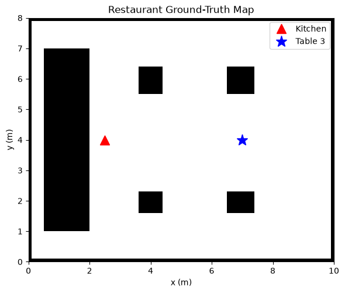
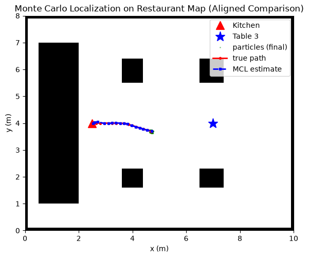
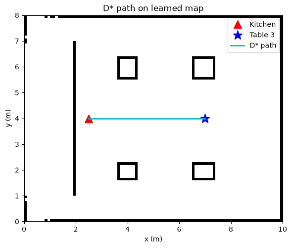
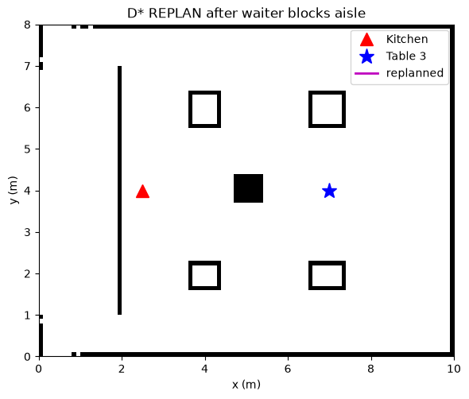
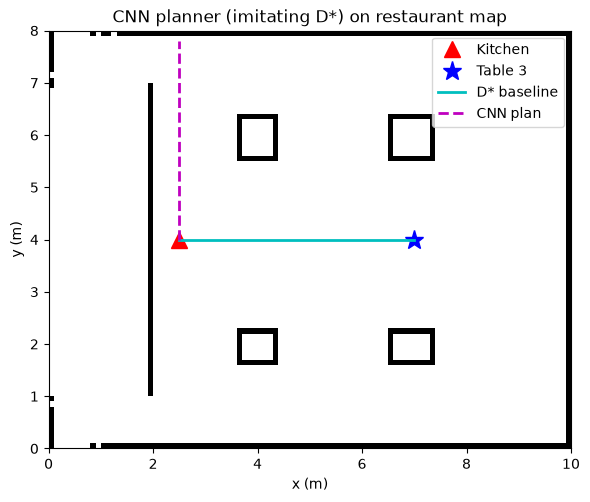
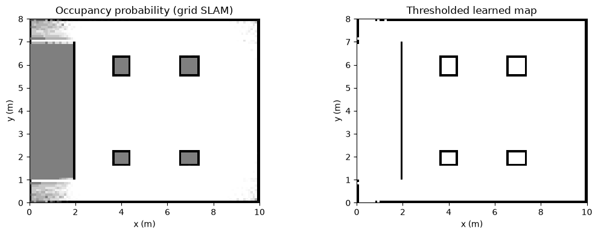
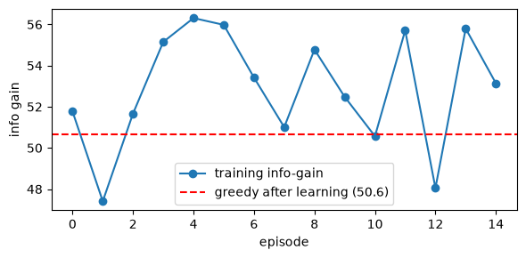

# AIML ZG528 – Assignment 2
## Part A – Research Paper Study

**Paper:** *Deep Reinforcement Learning with Enhanced PPO for Safe Mobile Robot Navigation* — H. Taheri, S. R. Hosseini, M. A. Nekoui (KN Toosi University of Technology).
**Chosen Domain (carried from Assignment 1):** Hospitality Bots – Restaurant Food Delivery Robot.

| Name | ID | Contribution |
|------|-----|-------------|
| Ayushi Gupta | 2024AC05720 | 100% |
| Ajay kumar   |2024ac05145  |100%|
| Ankur Pandey |2024ac05938  |100%|
| Kumar Kislay |2024ac05146  |100%|
| Surya Teja Malisetti  |2024ac05153  |100%|

### Table of Contents

- [I. Objective](#i-objective)
- [II. Domain](#ii-domain)
- [III. Scope of the Work](#iii-scope-of-the-work)
- [IV. Key Areas Open for Future Enhancement / Optimization](#iv-key-areas-open-for-future-enhancement--optimization)
- [V. Key Design Aspects of the Mobile-Robotics Phases](#v-key-design-aspects-of-the-mobile-robotics-phases)
- [VI. Key Results Snapshot (from the studied paper)](#vi-key-results-snapshot-from-the-studied-paper)
- [VII. Threats to Validity (Critical Appraisal)](#vii-threats-to-validity-critical-appraisal)
- [VIII. Appendix – Code and Simulation Outputs from Group2_Assignment2](#viii-appendix--code-and-simulation-outputs-from-group2assignment2)

---

### I. Objective
- The study aims to train a wheeled mobile robot for **mapless and collision-free navigation** toward arbitrary target locations.
- The robot is expected to make decisions using compact sensory inputs, primarily LiDAR-derived obstacle cues and robot state information.
- The paper investigates whether Proximal Policy Optimization (PPO), when enhanced with **Residual Blocks** in both actor and critic networks, can improve navigation quality.
- The reward design is structured to balance three practical behaviors:
	- continuous progress toward the goal,
	- safe clearance from obstacles,
	- smooth and stable movement commands.

### II. Domain
- The implementation domain is indoor mobile robotics using **TurtleBot3** as the test platform.
- Experiments are performed in **static and cluttered indoor environments** that represent narrow passages, walls, and obstacle-dense layouts.
- The full experimental stack uses ROS for middleware and Gazebo for simulation-based validation.
- The findings are transferable to service scenarios such as warehouse delivery, hospital assistance, and **restaurant food delivery** (selected domain for this assignment).

### III. Scope of the Work
- The paper formulates mapless navigation as a continuous-control Markov Decision Process (MDP).
- The observation space is 16-dimensional and combines:
	- 10 features from batched LiDAR minima,
	- previous linear and angular velocity,
	- goal location in polar coordinates,
	- yaw and heading-related orientation information.
- The action space is 2-dimensional:
	- linear velocity is bounded through a sigmoid output,
	- angular velocity is bounded through a tanh output.
- The proposed PPO policy uses ResBlock-enhanced actor and critic networks and is compared against vanilla PPO and DDPG baselines.
- Two reward formulations are evaluated:
	- a basic progress-oriented reward,
	- an advanced reward with stronger wall-proximity penalty and goal-approach shaping.
- Performance is reported in 10 x 10 m Gazebo worlds (obstacle-free and cluttered) using average reward, success rate, and steps per episode.

### IV. Key Areas Open for Future Enhancement / Optimization
1. **Address partial observability more robustly**
	- The current 30-beam LiDAR compressed into 10 minima can miss fine-grained scene cues.
	- Future models can include recurrent memory (LSTM/GRU), transformer-based policies, or richer sensing (e.g., RGB-D).
2. **Improve sample efficiency and Sim-to-Real transfer**
	- PPO training can be made more sample-efficient through better replay strategies, curriculum design, and hyperparameter scheduling.
	- Domain randomization should be expanded so policies generalize from Gazebo to real restaurant floors with friction changes, glare, and sensor noise.
	- Stronger baseline comparisons with off-policy methods (such as SAC/TD3) would improve scientific rigor.
3. **Introduce explicit safety guarantees**
	- Reward penalties encourage safety but do not guarantee constraint satisfaction.
	- Constrained or shielded RL methods (CMDP, control-barrier-function safety layers) are better suited for operation near people and hot payloads.
4. **Handle dynamic and social environments**
	- The studied setup focuses mainly on static obstacles.
	- Real service environments include moving staff and guests; therefore, social-navigation reward terms and multi-agent coordination are important next steps.
5. **Standardize evaluation benchmarks**
	- Cross-paper comparison remains difficult due to differing maps, metrics, and training protocols.
	- Shared reproducible benchmarks would improve fairness and repeatability.

---

### V. Key Design Aspects of the Mobile-Robotics Phases

**A. Deployment Platform.**
- The platform is **TurtleBot3**, a non-holonomic differential-drive robot commonly used for indoor autonomy experiments.
- Simulation is conducted in a 10 x 10 m walled Gazebo environment.
- Motion constraints are explicitly defined:
	- maximum linear speed: 0.25 m/s,
	- maximum angular speed: 1 rad/s.
- These limits mirror realistic safety constraints for indoor service robots such as restaurant delivery units.

**B. Sensors & Types.**
- Exteroceptive sensing is based on **2-D LiDAR** with 30 range values across the frontal 180-degree sector.
- All LiDAR readings are normalized to [0, 1] before policy input.
- Proprioceptive features include:
	- previous linear and angular velocity,
	- current yaw orientation.
- Goal input is provided as relative target position in polar coordinates (from simulator state).
- A key experimental condition is that the target is not directly detected by LiDAR; therefore, the policy must combine heading and motion history to navigate effectively.

**C. Perception – Sensor & Motion Models.**
- Sensor model:
	- Raw LiDAR data is grouped in batches of three beams.
	- The minimum value from each batch is retained, producing 10 compact obstacle-aware features.
	- This strategy prioritizes nearest-obstacle awareness while reducing computational load.
- Motion model:
	- The learned policy directly outputs continuous control commands (v, omega).
	- Differential-drive execution and physics are handled by ROS/Gazebo.
	- Control behavior is learned end-to-end from interaction data rather than hand-crafted motion equations inside the policy.

**D. Localization & Mapping.**
- The navigation strategy is **mapless** and avoids classical mapping pipelines.
- Specifically, the method does not build or maintain a global occupancy map and does not depend on a separate SLAM module.
- The policy relies on local sensory abstraction and relative-goal information at each step.
- Advantage:
	- lower system complexity and no map-maintenance burden.
- Limitation:
	- potentially weaker robustness in larger, dynamic, or partially observable spaces.
- Practical dependency:
	- reliable odometry/pose transforms remain essential for stable operation.

**E. Trajectory Planning.**
- The approach does not use explicit global or local path planners as separate modules.
- Instead, planning is performed in an **end-to-end reactive manner**:
	- at each control cycle, the actor predicts (v, omega),
	- the full trajectory emerges over time from repeated policy decisions.
- Residual connections improve optimization stability and help preserve informative gradients.
- Combined with reward shaping, this improves path quality in cluttered environments.

**F. Control Technique.**
- The control output is a direct continuous velocity command:
	- linear velocity is constrained to [0, v_max] via sigmoid,
	- angular velocity is constrained to [-omega_max, +omega_max] via tanh.
- Commands are applied to the differential-drive robot without a separate handcrafted controller.
- Learning uses the PPO clipped objective with reported learning rate 3 x 10^-4.
- As a result, policy quality improves iteratively without requiring explicit PID or MPC tuning.

Compact PPO objective reminder:
- r_t(θ) = π_θ(a_t|s_t) / π_{θ_old}(a_t|s_t)
- L^clip(θ) = E[min(r_t(θ)A_t, clip(r_t(θ), 1-ε, 1+ε)A_t)]

**G. Communication Infrastructure.**
- The communication backbone is **ROS** using topic-based publish/subscribe messaging.
- Gazebo provides synchronized simulation state, sensor streams, and dynamics.
- Core communication links include:
	- policy inference node,
	- robot state and sensor topics,
	- motion command topics to TurtleBot control interfaces.
- The current implementation is local and simulation-centered.
- For deployment in smart hospitality systems, the architecture can be extended using ROS 2 with Wi-Fi/MQTT integration to restaurant order-management services.

---

**Comparative note vs. traditional techniques.**
| Comparison Dimension | Traditional Robotics Stack | ResBlock-PPO (Learned Policy) |
|---|---|---|
| Architecture | Modular pipeline with separate localization, mapping, planning, and control blocks | End-to-end policy combining planning and control in one model |
| Typical Components | AMCL + occupancy-grid SLAM + A*/Dijkstra + DWA/TEB + PID | PPO actor-critic with residual blocks and continuous (v, omega) output |
| Environment Adaptation | Strong in known/structured maps but often needs manual re-tuning in layout changes | Better adaptation to new layouts through data-driven policy learning |
| Tuning Effort | Higher manual parameter tuning across multiple modules | Lower manual tuning after training, but training setup/hyperparameters still matter |
| Explainability | High; decisions are traceable per module | Lower; policy behavior is harder to interpret internally |
| Safety/Certification Readiness | Easier to audit and certify due to deterministic modules | Harder to certify without additional safety constraints/shields |
| Runtime Behavior | Predictable and stable when assumptions hold | Flexible behavior in complex scenes, but quality depends on training coverage |
| Best Use Case | Safety-critical deployments requiring deterministic and explainable behavior | Variable environments where adaptability and reduced hand-engineering are priorities |

Assignment mapping:
- Classical modules in this assignment: MCL, Grid-SLAM, D*.
- Learning-based modules in this assignment: RL exploration and CNN/deep policy alternatives.

---

### VI. Key Results Snapshot (from the studied paper)

| Scenario | Method | Trend on Success % | Trend on Reward | Trend on Steps |
|---|---|---|---|---|
| Obstacle-free world | Vanilla PPO | Strong | High | Low |
| Obstacle-free world | ResBlock-PPO | Comparable or better | High | Low |
| Cluttered world | DDPG | Lower stability | Lower | Higher |
| Cluttered world | Vanilla PPO | Better than DDPG | Moderate-high | Moderate |
| Cluttered world | ResBlock-PPO + advanced reward | Best among compared methods | Highest | Lowest / near-lowest |

Interpretation for our domain:
- In cluttered restaurant-like layouts, the combination of reward shaping and residual network design improves both safety-oriented behavior and goal completion reliability relative to simpler DRL baselines.

---

### VII. Threats to Validity

1. **Simulation-only evidence**
	- Results are obtained in Gazebo and may not transfer directly to real floors with wheel slip, lighting variation, sensor drift, and unpredictable human motion.
2. **Goal-information assumption**
	- Relative goal coordinates are reliably available in simulation through transforms; this assumption can be harder to satisfy in production deployments.
3. **Limited sensor diversity**
	- Compressed LiDAR-only observations can miss semantic cues such as transparent obstacles, reflective surfaces, and human intent, which are important in hospitality environments.

---

### VIII. Appendix – Code and Simulation Outputs from Group2_Assignment2

This appendix adds representative code snapshots and simulation outputs from `Group2_Assignment2.ipynb`.

#### A. Representative Code Snippets

1. Shared restaurant map setup (used across all parts)

```python
RES = 0.1
W, H = 100, 80
grid = np.zeros((H, W), dtype=np.uint8)

grid[0, :] = grid[-1, :] = 1
grid[:, 0] = grid[:, -1] = 1
grid[10:70, 5:20] = 1
```



2. Monte Carlo Localization update cycle

```python
measured_scan = scan(true_pose)
particles = motion_update(particles, (linear_vel, angular_vel))
weights = sensor_weights(particles, measured_scan)
estimates.append(estimate_pose(particles, weights))
particles = systematic_resample(particles, weights)
```



3. D* Lite planning and replanning flow

```python
planner = DStarLite(learned_grid, start_rc, goal_rc)
planner.compute_shortest_path()
path = planner.extract_path()

planner.add_obstacle_block((40, 50), half_size=3)
planner.compute_shortest_path()
path2 = planner.extract_path()
```





4. CNN imitation planner training step

```python
logits = net(X)
loss = F.cross_entropy(logits, Y)
loss.backward()
opt.step()
```



5. Grid-SLAM log-odds update core

```python
for free_row, free_col in bresenham(robot_row, robot_col, hit_row, hit_col)[:-1]:
	logodds[free_row, free_col] += L_FREE

if beam_range < 5.0:
	logodds[hit_row, hit_col] += L_OCC

np.clip(logodds, L_MIN, L_MAX, out=logodds)
```



6. RL frontier selection and TD update

```python
if np.random.rand() < eps:
	chosen = frontiers[np.random.randint(len(frontiers))]
else:
	chosen = max(frontiers, key=lambda f: score_frontier(f, robot_cell, known_mask))

key = (state_before, 'go')
old_q = Q.get(key, 0.0)
Q[key] = old_q + alpha * (reward - old_q)
```



7. CNN planner rollout decision step

```python
x = torch.tensor(make_sample(g, tuple(s), goal)[None], dtype=torch.float32)
with torch.no_grad():
	action_idx = int(net(x).argmax(1).item())

dr, dc = ACTIONS[action_idx]
nr, nc = s[0] + dr, s[1] + dc
```
