# AIML ZG528 – Viva Guide
## Assignments 1 & 2 | Hospitality Bot (Restaurant Food Delivery)
**Ayushi Gupta | 2024AC05720**

---

## Table of Contents

- [Beginner's Glossary](#beginners-glossary)
- [Quick Reference Map](#quick-reference-map)
- [Full Pipeline Diagram](#full-pipeline-diagram)

---

- **[PART 1 — Assignment 1](#part-1--assignment-1)**
  - [1.1 Robot System Description](#11-robot-system-description)
  - [1.2 Velocity-Based Motion Model](#12-velocity-based-motion-model)
  - [1.3 Beam-Based Sensor Model](#13-beam-based-sensor-model)
  - [1.4 Workplace Evaluation](#14-workplace-evaluation-question-3)

- **[PART 2 — Assignment 2](#part-2--assignment-2)**
  - [2.1 Overall Navigation Pipeline](#21-overall-navigation-pipeline)
  - [2.1 → Pipeline Step-by-Step (STEP 0 to STEP 5 + data flow)](#pipeline--step-by-step)
  - [2.1a Particles vs Waypoints — Key Difference](#particles-vs-waypoints--what-are-they-and-where-are-they-used)
  - [↳ What are PARTICLES and where used?](#particles)
  - [↳ What are WAYPOINTS and where used?](#waypoints)
  - [2.2 Part A — Monte Carlo Localization (MCL)](#22-part-a--monte-carlo-localization-mcl)
  - [↳ Why MCL and not EKF / Odometry / Histogram?](#why-mcl-and-not-the-alternatives)
  - [2.3 Part B — Grid SLAM (Occupancy Mapping)](#23-part-b--grid-slam-occupancy-mapping)
  - [↳ How Occupancy Grid and Log-Odds are Linked](#how-occupancy-grid-and-log-odds-are-linked)
  - [↳ Why Grid SLAM and not Graph SLAM / Visual SLAM?](#why-grid-slam-occupancy-mapping-and-not-the-alternatives)
  - [2.4 Part C — D* Lite Path Planning](#24-part-c--d-lite-path-planning)
  - [↳ Why D* Lite and not A* / Dijkstra / RRT?](#why-d-lite-and-not-the-alternatives)
  - [2.5 Part D — RL Frontier Exploration](#25-part-d--rl-for-frontier-exploration)
  - [↳ Why RL and not Greedy / Random frontier?](#why-rl-q-learning-for-frontier-selection-and-not-the-alternatives)
  - [2.6 Part E — CNN Planner (Imitation of D*)](#26-part-e--cnn-planner-imitation-of-d)
  - [↳ Why CNN and not DQN / PPO / RNN?](#why-cnn-imitation-learning-and-not-the-alternatives)
  - [2.7 Research Paper — Enhanced PPO](#27-part-a-research-paper--deep-rl-with-enhanced-ppo)

- **[PART 3 — Cross-Assignment Connections](#part-3--cross-assignment-connections)**
  - [3.1 How Ass-1 feeds Ass-2](#part-3--cross-assignment-connections)
  - [3.2 Why use BOTH MCL and SLAM?](#why-do-we-use-both-mcl-and-slam-arent-they-contradictory)

- **[PART 4 — Formula Cheat Sheet](#part-4--formula-cheat-sheet)**

- **[PART 5 — Top 20 Rapid-Fire Q&A](#part-5--top-20-viva-questions-rapid-fire)**

- **[PART 6 — 30-Second Verbal Scripts for Viva](#part-6--how-to-explain-each-module-in-30-seconds)**

- **[PART 7 — Pipeline Decisions At A Glance (Full Summary Table)](#part-7--pipeline-decisions-at-a-glance)**

- **[PART 8 — Tricky & Surprise Viva Questions](#part-8--tricky--surprise-viva-questions)**

- **[PART 9 — Failure Modes: What Can Go Wrong?](#part-9--failure-modes-what-can-go-wrong)**

- **[PART 10 — Computational Complexity Quick Reference](#part-10--computational-complexity-quick-reference)**

- **[PART 11 — Why Not Bio-Inspired Algorithms? (ACO, PSO, Firefly, GA)](#part-11--why-not-bio-inspired-algorithms)**

---

## Beginner's Glossary

> **New to robotics? Start here.** These are the key words used throughout this guide — in plain English.

| Term | Plain English meaning |
|---|---|
| **AMR** | Autonomous Mobile Robot — a robot that moves on its own without a human driving it |
| **Differential Drive** | A robot with two independently controlled wheels (like a wheelchair) — speed the wheels differently to turn |
| **Proprioceptive Sensor** | Sensor that feels the robot's own body (like how you feel your muscles moving) — e.g. wheel encoders |
| **Exteroceptive Sensor** | Sensor that looks at the outside world — e.g. camera, LiDAR |
| **LiDAR** | "Laser radar" — fires laser beams in all directions and measures how far they travel before hitting something |
| **IMU** | Inertial Measurement Unit — measures tilt, rotation speed, and acceleration (like a phone's motion sensor) |
| **Odometry** | Estimating position by counting wheel rotations — like estimating distance walked by counting steps |
| **Pose** | The robot's complete position: (x coordinate, y coordinate, direction it is facing θ) |
| **Gaussian Noise** | Random errors that follow a bell-curve pattern — most errors are small, big errors are rare |
| **Probabilistic Model** | A model that doesn't give one fixed answer but a range of possibilities with likelihoods |
| **Particle** | In MCL — one hypothesis (guess) about where the robot might be. Hundreds run in parallel |
| **Occupancy Grid** | A map divided into square cells; each cell stores whether it is free (empty) or occupied (wall/obstacle) |
| **Log-Odds** | A clever math trick to represent probability — makes repeated sensor updates simple addition instead of multiplication |
| **SLAM** | Simultaneous Localization And Mapping — building a map and figuring out your position at the same time |
| **Frontier Cell** | A cell on the edge between known (explored) and unknown (unexplored) map area |
| **D* Lite** | A path-planning algorithm that can quickly fix its route when an obstacle appears, without replanning from scratch |
| **RL (Reinforcement Learning)** | Teaching a computer to make decisions by giving it rewards for good choices and no reward (or penalties) for bad ones |
| **Q-value** | In RL — a score that represents how good an action is in a given situation |
| **ε-greedy** | A strategy that mostly picks the best known action but occasionally tries something random (to discover better options) |
| **CNN** | Convolutional Neural Network — a type of AI that learns to recognize patterns in grid/image data |
| **Imitation Learning** | Training an AI by showing it examples of an expert's decisions, so it learns to copy the expert |
| **PPO** | Proximal Policy Optimization — a popular algorithm to train robots using trial-and-error without making dangerously large updates |
| **Residual Block** | A neural network building block that adds a "shortcut" connection, helping gradients flow and preventing training from getting stuck |
| **Mapless Navigation** | The robot finds its way using only its current sensor readings and goal direction — no pre-built map needed |
| **IoU** | Intersection over Union — a score from 0 to 1 measuring how closely the robot's built map matches the true map |
| **Dead-reckoning** | Estimating current position from past position + speed + direction — accumulates error over time with no correction |

---

## Quick Reference Map

| Assignment | Topics Covered |
|---|---|
| **Ass-1** | Robot description, Probabilistic motion model, Beam sensor model, Workplace evaluation |
| **Ass-2** | MCL localization, Grid SLAM, D* Lite path planning, RL frontier exploration, CNN planner, Deep RL paper (PPO) |

---

## Full Pipeline Diagram

```mermaid
flowchart TD
    subgraph ASS1["ASSIGNMENT 1 — Probabilistic Models"]
        direction TB
        A1([Robot AMR\nDifferential Drive]) --> A2[Sensor Suite\nLiDAR · Camera · IMU · Encoders]
        A2 --> A3[Velocity-Based\nMotion Model\nα₁–α₆ Gaussian Noise]
        A2 --> A4[Beam Sensor Model\np_hit · p_short · p_max · p_rand]
        A3 --> A5[Monte Carlo\nTrajectory Simulation\n100 paths · 1σ / 2σ ellipses]
        A4 --> A6[Sensor Readings\nper Pose]
        A3 --> A7[Floor Condition Analysis\nRubber · Wood · Wet]
        A5 --> A8[(Pose Uncertainty\nQuantified)]
        A6 --> A8
        A7 --> A8
        A8 --> A9[Workplace Evaluation\nABB Robotics Context]
    end

    subgraph ASS2["ASSIGNMENT 2 — Full Navigation Stack"]
        direction TB
        B0([Shared Restaurant Map\n10m × 8m Grid]) --> B1

        B1[Part A: MCL\nMonte Carlo Localization]
        B1 --> B1a[Predict particles\nvia motion model]
        B1a --> B1b[Weight by scan\nlikelihood]
        B1b --> B1c[Estimate pose\nfrom particles]
        B1c --> B1d[Resample particles]
        B1d --> B1e[(Estimated Path\n+ Error Curve)]

        B0 --> B2[Part B: Grid SLAM\nOccupancy Mapping]
        B2 --> B2a[Lawnmower Waypoints]
        B2a --> B2b[Ray-Cast Beams\nfree + occupied evidence]
        B2b --> B2c[Log-Odds Updates]
        B2c --> B2d[(Learned Map\nIoU vs Ground Truth)]

        B2d --> B3[Part C: D* Lite\nPath Planning]
        B3 --> B3a[Initial Path Compute]
        B3a --> B3b[Insert Dynamic Obstacle]
        B3b --> B3c[Incremental Replan\naffected vertices only]
        B3c --> B3d[(Replanned Path)]

        B0 --> B4[Part D: RL\nFrontier Exploration]
        B4 --> B4a[Detect frontier cells]
        B4a --> B4b[ε-greedy frontier pick]
        B4b --> B4c[Simulate scan update]
        B4c --> B4d[Reward = new cells revealed]
        B4d --> B4e[Q-update]
        B4e --> B4f[(Learned Q-table\nEfficient Coverage)]

        B2d --> B5[Part E: CNN Planner\nImitation of D*]
        B5 --> B5a[Generate maps\nQuery D* labels]
        B5a --> B5b[2-channel local\nobservation]
        B5b --> B5c[Train CNN\ncross-entropy loss]
        B5c --> B5d[Rollout on\nlearned map]
        B5d --> B5e[(CNN Path\nvs D* Path)]
    end

    subgraph PAPER["PART A — Research Paper: Enhanced PPO"]
        direction TB
        C1([TurtleBot3\nGazebo 10×10m]) --> C2[16-dim Observation\n10 LiDAR + vel + goal + yaw]
        C2 --> C3[ResBlock Actor-Critic\nPPO Clipped Objective]
        C3 --> C4[2D Continuous Action\nlinear via sigmoid · angular via tanh]
        C4 --> C5[Advanced Reward\ngoal shaping + wall penalty]
        C5 --> C6[(Mapless Navigation\nBest success rate in clutter)]
    end

    ASS1 --> |"Motion & sensor models\nreused in MCL + SLAM"| ASS2
    ASS2 --> |"Classical vs learned\npipeline comparison"| PAPER
```



---

## PART 1 — ASSIGNMENT 1

> **Big picture (Assignment 1 in one sentence):**
> We build the mathematical foundation — how does the robot *move* (motion model) and how does it *see* (sensor model) — using probability so the robot "knows what it doesn't know."

---

### 1.1 Robot System Description

> **In simple words:** We are designing a self-driving food delivery robot for a restaurant. Before writing any code, we describe *what* the robot is, *what sensors it has*, and *why* those sensors are the right choice for a noisy, busy environment.

**Q: What type of robot is used and what does it do?**
- Autonomous Mobile Robot (AMR) on a differential-drive platform.
- Task: Deliver food from kitchen counter to dining tables autonomously.
- Environment: 10 m × 8 m indoor restaurant; kitchen + dining area.

**Q: What are the key challenges of the restaurant environment?**
- Dynamic obstacles: waiters walking, guests standing up, chairs pulled out.
- Floor surface variation: rubber mat (kitchen), wooden/tile (dining), wet/spill zones.
- Safety constraints: must never collide with people or spill food; must operate quietly.

**Q: What sensors does the robot use and why?**

| Sensor | Type | Purpose |
|---|---|---|
| Wheel Encoders (Optical Rotary) | Proprioceptive | Dead-reckoning — provides (v, ω) for motion model |
| IMU (Gyroscope + Accelerometer) | Proprioceptive | Corrects odometry drift; compensates wheel slip on wet floors (α₅, α₆) |
| 2D LiDAR (RPLIDAR A2, 360°) | Exteroceptive | Obstacle detection — modeled by beam sensor (p_hit, p_short, p_max, p_rand) |
| RGB-D Camera (Intel RealSense D435) | Exteroceptive | Table number recognition, close-range obstacle avoidance |

---

### 1.2 Velocity-Based Motion Model

> **In simple words:** When you tell the robot "go straight at 0.5 m/s", it doesn't go *perfectly* straight — wheels slip, motors wobble, floors are uneven. The motion model mathematically describes this imperfection using Gaussian (bell-curve) noise, so we can predict *where the robot probably ended up* rather than assuming it went exactly where commanded.
>
> **Analogy:** Like throwing a dart — you aim at the bullseye, but there's always a small random scatter around where it lands. With more throws (more motion steps) the scatter adds up.

**Q: What is the velocity-based motion model?**
- Takes commanded velocities (v, ω) and adds Gaussian noise via 6 parameters (α₁–α₆).
- Uses circular-arc kinematics to compute the robot's new pose.
- Models real-world imperfections: wheel slip, motor imprecision.

**Q: What do the α parameters represent?**
- α₁, α₂: noise in translation due to rotational and translational velocity.
- α₃, α₄: noise in rotation due to translational and rotational velocity.
- α₅, α₆: extra noise terms (used by IMU-correction to compensate slip).
- Higher α → more uncertain motion (e.g., wet floor = higher α).

> **Beginner tip:** Think of α values as "how wobbly is this surface?" A rubber mat gets low α (predictable), a wet spill zone gets high α (very unpredictable). The robot uses these numbers to spread its uncertainty appropriately.

**Q: What are the kinematics equations?**

$$x' = x - \frac{\hat{v}}{\hat{\omega}}\sin\theta + \frac{\hat{v}}{\hat{\omega}}\sin(\theta + \hat{\omega}\Delta t)$$

$$y' = y + \frac{\hat{v}}{\hat{\omega}}\cos\theta - \frac{\hat{v}}{\hat{\omega}}\cos(\theta + \hat{\omega}\Delta t)$$

$$\theta' = \theta + \hat{\omega}\Delta t + \hat{\gamma}\Delta t$$

**Q: What does the Monte Carlo trajectory simulation show?**
- 100 simulated deliveries with same commands but different noise realizations.
- Paths spread apart as robot moves further → uncertainty grows with distance.
- 1σ ellipse (~68% endpoints), 2σ ellipse (~95%) show positional uncertainty.

**Q: What is the effect of different floor conditions?**

| Surface | Effect |
|---|---|
| Rubber mat (kitchen) | Tight clustering — minimal uncertainty |
| Wooden floor (dining) | Moderate spread — generally on course |
| Wet/spill area | Large spread — could miss table entirely |

→ This justifies **probabilistic planning** in the restaurant.

> **Why does this matter?** A deterministic (non-probabilistic) robot would assume it arrived exactly at the table and try to place food there — even if it's 20 cm off. A probabilistic robot "knows" it might be off and can ask for confirmation, slow down, or request a sensor correction.

---

### 1.3 Beam-Based Sensor Model

> **In simple words:** The LiDAR fires a laser beam and gets back a distance reading. But that reading is not always perfect — sometimes something blocks the beam early, sometimes the beam gets no return at all, sometimes there's pure random garbage. Instead of ignoring these cases, we *model* all four possible outcomes mathematically so the robot can figure out what probably happened.
>
> **Analogy:** Imagine asking "how far is the wall?" Your friend answers: sometimes correctly, sometimes says a shorter distance (because someone walked in front), sometimes says "I don't know" (no reflection), and occasionally gives a random number. The sensor model is just writing down probabilities for each of those four answer types.

**Q: What are the 4 components of the beam sensor model?**

| Component | Explanation | Real-world scenario |
|---|---|---|
| p_hit (Gaussian) | Most readings are correct, clustered around true distance | Normal wall/table detection |
| p_short (Exponential) | Unexpected obstacle between robot and wall | Waiter stepping into beam |
| p_max (Uniform near max-range) | Sensor returns no reading | Long open aisle, mirror-like reflections |
| p_rand (Uniform) | Random noise or glitch | Reflective metal surfaces on floors |

**Q: How are these combined?**
$$p(z|z^*) = \alpha_{hit} \cdot p_{hit} + \alpha_{short} \cdot p_{short} + \alpha_{max} \cdot p_{max} + \alpha_{rand} \cdot p_{rand}$$
where the α weights sum to 1.

**Q: What does a sensor reading of z < z* tell you?**
- An unexpected obstacle is closer than the true wall — p_short component captures this (exponential decay; closer = more likely).

---

### 1.4 Workplace Evaluation (Question 3)

> **In simple words:** This section connects the robotics theory to the real world. The key message is: *uncertainty is everywhere in real factories and restaurants* — sensors are imperfect, surfaces vary, people move unexpectedly. Probabilistic models are the engineering answer to handling that uncertainty gracefully instead of crashing or failing.

**Q: Why is probabilistic modeling valuable in your workplace?**
- ABB Robotics factory floors: payload variations and joint wear create motion uncertainty.
- Probabilistic motion model prevents overconfidence in position estimates.
- Beam sensor model handles dynamic obstacles (forklifts, workers) naturally via p_short.

**Q: What is the practical impact on the restaurant robot?**
- ~20–30 deliveries per service shift handled autonomously.
- ~40% reduction in routine wait-staff workload for food delivery runs.
- Reduces manual intervention through uncertainty-aware planning.

---

---

## PART 2 — ASSIGNMENT 2

> **Big picture (Assignment 2 in one sentence):**
> Now that we can model motion and sensing, we build the **full brain** of the robot — it localizes itself, builds a map of unknown space, plans a path, learns to explore smarter, and finally experiments with replacing the classical planner with a deep-learning model.

---

### 2.1 Overall Navigation Pipeline

> **In simple words:** A full navigation system is like a chain of specialists working together:
> 1. *Where am I?* → MCL answers this
> 2. *What does the room look like?* → SLAM answers this
> 3. *How do I get there?* → D* Lite answers this
> 4. *Where should I look next?* → RL answers this
> 5. *Can I do planning without hand-coded rules?* → CNN answers this

---

#### Pipeline — Step by Step

**STEP 0 — Setup (Shared Environment)**
- Build one consistent restaurant map: 10m × 8m grid with walls, kitchen counter, 4 dining tables
- Define resolution (`RES`), grid dimensions (`W`, `H`), start and goal positions
- Every later module uses this same map — ensures fair comparison across parts
- Key variables created here: `grid`, `start_xy`, `goal_xy`, `start_rc`, `goal_rc`
- **Why this step exists:** Without a shared world, each module would operate in a different environment and results couldn't be compared

---

**STEP 1 — Part A: Monte Carlo Localization (MCL)**

> #### ❓ "We already have a shared map from Step 0 — so why do we need MCL? Why doesn't the robot just know where it is?"
>
> **This is the single most important thing to understand about Step 1.**
>
> Having a map and knowing your position on it are two completely different things.
>
> **Analogy:** You are handed a Google Maps screenshot of your city. Then you are blindfolded, driven around, and dropped somewhere. You still have the map — but you have no idea which street you are currently standing on. The map tells you what the world looks like. It does NOT tell you where YOU are in it right now.
>
> **In the robot's case:**
> - The shared `grid` from Step 0 says: *"there is a wall here, a table there"* — it describes the environment
> - But the robot's current position `(x, y, θ)` is a dynamic variable — it changes every single timestep as the robot moves
> - After just a few delivery moves, the robot's wheels have slipped, its motors weren't perfect, and it no longer knows exactly where it ended up
> - MCL continuously answers the question: *"given what my LiDAR is seeing RIGHT NOW, where on this map am I most likely standing?"*
>
> **Why can't the robot just count its wheel turns (odometry)?**
> - We showed in Assignment 1 that wheel slip on wet floors causes α parameters to be high
> - Small errors at each step accumulate — after 30 seconds of delivery, the robot could be 50 cm off from where it thinks it is
> - That 50 cm error means it tries to place food in the wrong spot, or drives into a chair
> - MCL corrects this drift at every timestep using the LiDAR as an external reference
>
> **One-line answer for viva:**
> *"The map tells the robot what the world looks like. MCL tells the robot where it currently IS in that world. Both are needed — one without the other is useless."*

> #### ❓ "Can't we find the pose once at the start and just track it from there?"
>
> **No — and this is crucial. Pose must be found continuously, at every single timestep.**
>
> Here is why it can never be "done once":
>
> | Reason | What happens without continuous pose update |
> |---|---|
> | **Wheel slip** | Every step introduces a small position error — errors add up silently |
> | **Motor imprecision** | The robot commands "move 0.5m" but actually moves 0.48m |
> | **Turning drift** | Small heading errors after each turn compound into large positional errors |
> | **Dynamic obstacles** | A guest bumps the robot — its physical position jumps but odometry doesn't know |
> | **Accumulated drift** | After 10 delivery steps, the robot thinks it is at (4.0, 3.0) but is actually at (4.6, 2.7) |
>
> **The continuous MCL loop — runs non-stop during every delivery:**
> ```
> [Robot moves one step]
>       ↓
> Move all particles forward with noisy motion model
>       ↓
> Fire LiDAR → compare each particle's expected scan to actual scan
>       ↓
> Weight particles → resample
>       ↓
> New best pose estimate for THIS timestep
>       ↓
> [Robot moves next step] → repeat forever
> ```
>
> **Think of it like GPS on your phone:** Your phone doesn't find your location once and stop. It continuously re-estimates your position because you keep moving and small errors keep building. MCL is exactly this — a continuous, self-correcting pose tracker.
>
> **If MCL stopped running mid-delivery:**
> - The robot would rely on odometry alone
> - Over a 30-second delivery path (~20 steps), accumulated drift could be 30–50 cm
> - The robot would miss the table, bump into chairs, or stop at the wrong location
>
> **Key viva sentence:**
> *"Pose estimation is not an initialisation step — it is a continuous real-time filter that runs for every timestep of the robot's operation. The robot's position is always uncertain and always being re-estimated."*

- **Input:** Known map (`grid`) + sequence of motion commands + simulated LiDAR readings
- **What it does:**
  - Maintains 500 particles, each a possible pose `(x, y, θ)`
  - Every timestep: move particles with noisy motion model → score them against LiDAR → resample
  - Over time particles converge to the true robot location
- **Output:** Estimated robot path + position error curve
- **Dependency on previous step:** Uses `grid` from Setup to score particles
- **Why before SLAM:** Demonstrates the *localization* problem in isolation first — assumes map is known, focuses only on pose estimation
- **What it does NOT do:** Build any map; only estimates pose on an existing one

#### Why MCL and not the alternatives?

| Alternative | Why NOT chosen |
|---|---|
| **Pure Odometry / Dead-reckoning** | No sensor correction — errors accumulate unboundedly; robot drifts far from true pose over a full delivery |
| **EKF Localization (Extended Kalman Filter)** | Assumes the pose uncertainty is a single Gaussian (unimodal) — fails when robot is kidnapped or starts in an unknown position; cannot represent multi-modal distributions |
| **Histogram / Grid Filter** | Discretizes the whole state space into cells — very high memory cost for a continuous 3D pose space `(x, y, θ)`; computationally expensive |
| **MCL (chosen)** | Handles multi-modal uncertainty (multiple hypotheses); scales well; easy to add/remove particles dynamically; naturally handles the restaurant's crowded, noisy environment |

---

**STEP 2 — Part B: Grid SLAM (Occupancy Mapping)**
- **Input:** Robot motion (lawnmower waypoints) + LiDAR beam readings at each waypoint
- **What it does:**
  - Robot follows a pre-planned lawnmower path across the full floor
  - At each waypoint: fire LiDAR beams, update log-odds for free cells (along beam) and occupied cells (at endpoint)
  - After full coverage: convert log-odds → probabilities → threshold to binary map
- **Output:** `learned_grid` — the robot's own reconstructed occupancy map
- **Dependency on previous step:** Uses same restaurant layout as ground truth for IoU comparison
- **Why after MCL:** Demonstrates the *mapping* problem in isolation — assumes pose is approximately known (from waypoints), focuses on building the map
- **What it does NOT do:** Localize the robot; only builds the map

#### Why Grid SLAM (occupancy mapping) and not the alternatives?

| Alternative | Why NOT chosen |
|---|---|
| **Feature-based SLAM (landmarks)** | Requires stable, distinguishable landmarks — a restaurant has few reliable features; tables and chairs move, guests obstruct views |
| **Graph SLAM / Pose Graph SLAM** | More powerful but significantly more complex — needs loop closure detection and global graph optimization; overkill for a single-floor bounded environment |
| **ORB-SLAM / Visual SLAM** | Needs a camera and rich visual texture; our robot uses 2D LiDAR as primary sensor, not RGB image streams |
| **3D Voxel Mapping** | Unnecessary for a flat restaurant floor; 2D occupancy grid captures all relevant obstacles with far lower memory and compute cost |
| **Grid SLAM with log-odds (chosen)** | Simple, interpretable, works directly with 2D LiDAR; log-odds updates are additive and numerically stable; output directly usable by D* planner |

---

**STEP 3 — Part C: D* Lite Path Planning**
- **Input:** `learned_grid` (from SLAM) + `start_rc` + `goal_rc`
- **What it does:**
  - Computes shortest path from kitchen to target table on the SLAM-built map
  - Simulates a new dynamic obstacle appearing mid-path
  - Incrementally replans — only updates affected graph vertices, not the whole path
- **Output:** Initial path + replanned path after obstacle insertion
- **Dependency on previous step:** Directly uses `learned_grid` produced by SLAM — not the ground truth map
- **Why after SLAM:** You cannot plan a path until you have a map; SLAM provides that map
- **What it does NOT do:** Re-explore the space or re-localize; just plans on the existing map

#### Why D* Lite and not the alternatives?

| Alternative | Why NOT chosen |
|---|---|
| **Dijkstra's Algorithm** | Explores all nodes uniformly with no goal-direction bias — correct but very slow in large grids; no replanning capability |
| **A\*** | Efficient for static maps but replans the *entire* path from scratch after every obstacle change — unacceptable latency in a dynamic restaurant |
| **RRT / RRT\*** | Sampling-based — better for continuous high-dimensional spaces; but on a discrete occupancy grid it is slower and less predictable than graph search |
| **Potential Fields** | Simple reactive method; gets stuck in local minima (e.g., dead-end between two tables); no guarantee of reaching the goal |
| **D\* Lite (chosen)** | Designed for dynamic environments — repairs only the affected portion of the plan; constant-time replanning for small obstacle changes; optimal on discrete grids |

---

**STEP 4 — Part D: RL for Frontier Exploration**
- **Input:** Partially known map state + list of frontier cells + Q-learning parameters
- **What it does:**
  - During the mapping process, identifies all frontier cells (free cells touching unknown space)
  - Uses ε-greedy policy to pick which frontier to explore next
  - Simulates scanning from the chosen frontier; counts newly revealed cells as reward
  - Updates Q-value: `Q ← Q + α(reward − Q)`
  - Over episodes: learns which frontier types reveal the most new space
- **Output:** Learned Q-table + information-gain curve per episode
- **Dependency on previous step:** Uses the same map/grid conventions and ray model established in SLAM
- **Why this module exists:** Naïve SLAM visits waypoints in a fixed order regardless of what's been learned — RL makes the exploration *adaptive* and more efficient
- **What it does NOT do:** Change the mapping update rule; only changes which frontier is chosen next

#### Why RL (Q-learning) for frontier selection and not the alternatives?

| Alternative | Why NOT chosen |
|---|---|
| **Greedy Nearest Frontier** | Always picks the physically closest frontier — efficient in travel time but often reveals little new space (close frontiers are usually small gaps) |
| **Random Frontier Selection** | No learning — performs consistently poorly and doesn't improve over episodes |
| **Full Deep RL (DQN / PPO) for exploration** | Overkill for this decision — the frontier selection problem has a small, discrete action space; a simple Q-table is sufficient and far easier to interpret |
| **Boustrophedon (lawnmower) decomposition** | Fixed pattern with no adaptation — cannot adjust to what has already been revealed or prioritize high-information areas |
| **Q-learning ε-greedy (chosen)** | Lightweight, interpretable, improves over episodes; RL only affects the *decision layer* while the classical log-odds mapping stays stable and reliable |

---

**STEP 5 — Part E: CNN Planner (Imitation of D*)**
- **Input:** `learned_grid` + D*-generated expert action labels
- **What it does:**
  - Generates thousands of random obstacle maps
  - For each map: runs D* and records its first move (up/down/left/right)
  - Builds a 2-channel local observation patch: [occupancy window around robot, goal direction channel]
  - Trains a CNN with cross-entropy loss to predict D*'s action
  - Rolls out the trained CNN on the actual restaurant `learned_grid`
- **Output:** Trained CNN model + rollout path compared against D* path
- **Dependency on previous step:** Uses `learned_grid` from SLAM; 4-class output matches D*'s 4-connected movement
- **Why this module exists:** Explores whether a learned policy can *replace* a classical planner — faster inference, no graph search at runtime
- **What it does NOT do:** Replace D* completely; D* is still the gold standard fallback

#### Why CNN (imitation learning) and not the alternatives?

| Alternative | Why NOT chosen |
|---|---|
| **DQN (Deep Q-Network)** | Learns from trial-and-error in the environment — requires many expensive environment interactions and careful reward shaping; much slower to train than imitation |
| **PPO / Actor-Critic RL** | End-to-end RL training is complex; no guarantee it matches D* quality; requires thousands of episodes vs supervised imitation on pre-collected labels |
| **RNN / LSTM planner** | Useful for partially observable long-horizon planning; but the local patch observation already captures the necessary context without needing recurrent memory |
| **Just use D\* always** | D* requires a graph search at every step — CNN inference is O(1) and faster at runtime; learning-based planner also generalizes to unseen map layouts D* hasn't been tuned for |
| **CNN imitation (chosen)** | Trains on D* expert decisions → fast convergence; no environment interaction needed; directly inherits D*'s optimality on training maps; simple cross-entropy loss |

---

**How the steps connect — data flow summary:**

```
STEP 0 (Setup)
  │
  ├──► grid ──────────────────────────────► STEP 1 (MCL): score particles against map
  │
  ├──► grid (ground truth) ───────────────► STEP 2 (SLAM): compare learned map via IoU
  │
  │         learned_grid (SLAM output)
  │               │
  │               ├──────────────────────► STEP 3 (D* Lite): plan path on learned map
  │               │
  │               ├──────────────────────► STEP 4 (RL): same map conventions for frontier scan
  │               │
  │               └──────────────────────► STEP 5 (CNN): rollout on learned map; compare to D*
  │
  └──► start_rc, goal_rc ─────────────────► STEPS 3, 4, 5: shared start and goal positions
```

---

**Key shared variables:** `grid`, `learned_grid`, `RES`, `W`, `H`, `start_xy`, `goal_xy`, `start_rc`, `goal_rc`

---

#### What is `start_rc` and `goal_rc`? How are they different from `start_xy` and `goal_xy`?

> There are **two coordinate systems** in the pipeline. Every position exists in both — the right one is used depending on whether the module works in continuous space or on a discrete grid.

**`start_xy` / `goal_xy` — Metric coordinates (real-world metres)**
- Format: `(x, y)` in metres
- Example: `start_xy = (0.5, 0.5)` means 0.5 m from the bottom-left corner of the restaurant
- Used by: **MCL** — which tracks the robot's continuous real-world position `(x, y, θ)`
- Why: MCL propagates particles in continuous space using the velocity motion model

**`start_rc` / `goal_rc` — Grid coordinates (row, column cell index)**
- Format: `(row, col)` — integer index into the occupancy grid array
- Example: `start_rc = (2, 2)` means cell at row 2, column 2 of the grid
- Used by: **D\* Lite, RL, CNN** — all of which operate on the discrete occupancy grid
- Why: D\* searches over grid cells (nodes), RL selects frontier cells by index, CNN predicts moves on a grid patch

**How to convert between them:**
```
row = int(y / RES)       col = int(x / RES)       ← xy  →  rc
x   = col * RES          y   = row * RES           ← rc  →  xy
```
where `RES` = resolution (metres per cell), e.g. `RES = 0.1` means each cell = 10 cm × 10 cm

**Side-by-side example (RES = 0.1 m):**

| Variable | Value | Meaning |
|---|---|---|
| `start_xy` | `(0.5, 0.5)` | Kitchen position: 0.5 m along x, 0.5 m along y |
| `start_rc` | `(5, 5)` | Same position as cell row 5, column 5 in the grid |
| `goal_xy` | `(7.5, 3.0)` | Table 3 position: 7.5 m along x, 3.0 m along y |
| `goal_rc` | `(30, 75)` | Same position as cell row 30, column 75 in the grid |

**Why have both?**
- The physical world is continuous — MCL needs metres to simulate robot motion and sensor beams
- The planning world is discrete — D\* needs integer cell indices to build and search a graph
- Keeping both means each module uses the representation that suits it best
- They always refer to the same physical point — just expressed differently

> **One-line rule:**
> - `_xy` = real-world metres → used by continuous modules (MCL, motion model)
> - `_rc` = grid cell index → used by discrete modules (D\*, RL, CNN)

---

### Particles vs Waypoints — What Are They and Where Are They Used?

> A very common confusion. These two concepts appear in different parts but are often mixed up.

#### PARTICLES
- **What they are:**
  - A particle = one hypothesis (one guess) about the robot's current pose `(x, y, θ)`
  - Hundreds of particles run in parallel at the same time
  - Each particle is a complete pose estimate — not a position to move to
- **What they store:** `(x, y, θ, weight)` — position, direction, and how likely that guess is
- **Where used:** **MCL only (Part A)**
- **Purpose:** To answer *"where is the robot right now?"* on a known map
- **How they work:**
  - Start: scattered randomly (or near last known pose) across the map
  - Each step: moved forward using the noisy motion model
  - After each LiDAR scan: scored (weighted) based on how well they match the map
  - Low-weight particles are removed; high-weight particles are copied (resampling)
  - Over time: cluster tightly around the true robot location
- **Analogy:** 500 invisible clones of the robot, each trying a different "where I might be" — the ones that match sensor readings survive

#### WAYPOINTS
- **What they are:**
  - A waypoint = a pre-defined target position `(x, y)` the robot should physically move to
  - A sequence of waypoints forms a planned path
  - The robot moves from one waypoint to the next, one at a time
- **What they store:** `(x, y)` grid coordinates — just a destination
- **Where used:** **Grid SLAM only (Part B)**
- **Purpose:** To systematically cover the entire restaurant floor so every area gets scanned
- **How they work:**
  - A lawnmower pattern (row by row) is pre-computed across the map
  - Robot visits each waypoint in order
  - At each waypoint: fires LiDAR beams and updates the occupancy map
  - No uncertainty involved — these are commanded destinations, not guesses
- **Analogy:** A cleaning robot set to sweep every row of a room in order — it just follows the grid

#### Side-by-Side Comparison

| Feature | Particles (MCL) | Waypoints (SLAM) |
|---|---|---|
| What it represents | A guess about current robot pose | A target position to physically move to |
| How many at once | Hundreds simultaneously | One at a time (sequence) |
| Contains uncertainty? | Yes — each has a weight (likelihood) | No — deterministic destinations |
| Created by | Randomly sampled / propagated | Pre-computed lawnmower grid |
| Updated how? | Moved by motion model + weighted by sensor | Robot drives there; no update to waypoint itself |
| Purpose | Estimate WHERE the robot IS | Define WHERE the robot should GO |
| Used in | Part A — MCL | Part B — Grid SLAM |
| Dies / removed? | Yes — low-weight particles are deleted | No — all waypoints are visited in order |

> **One-line rule to remember:**
> - **Particles** = *"Where do I think I am?"* → MCL
> - **Waypoints** = *"Where should I go next?"* → SLAM

---

### 2.2 Part A — Monte Carlo Localization (MCL)

> **In simple words:** The robot has a map of the restaurant (like a floor plan), but it doesn't know exactly *where on the map it currently is*. MCL solves this by keeping hundreds of "guesses" (particles) about its location all at once, and gradually eliminating the wrong guesses using sensor readings — like a game of "hot or cold".
>
> **Analogy:** Imagine you are blindfolded inside a building with a floor plan. You take a few steps and feel the floor, hear sounds, smell things. Each clue eliminates some locations on the map. After enough clues, you narrow down to roughly where you are. MCL does exactly this — mathematically and in milliseconds.

**Q: What does MCL do?**
- Estimates robot pose on a **known map** using particles
- Input: known map + control commands + LiDAR readings
- Output: estimated path + position error curve over the full trajectory
- **Particles are used here** — NOT waypoints

**Q: What exactly is a particle in MCL?**
- Each particle = one possible robot pose `(x, y, θ)`
- Weight = how well that particle's simulated LiDAR matches the actual LiDAR reading
- More weight = more likely to be the true pose
- Hundreds of particles run simultaneously

**Q: Describe the MCL loop step by step.**
1. **Initialise** — scatter N particles across the map (random or near last known pose)
2. **Predict** — move every particle forward using the noisy motion model; each particle takes a slightly different noisy path
3. **Weight** — at the new pose, simulate a LiDAR scan for each particle; compare it to the actual scan; particles that match well get high weight
4. **Estimate** — compute the weighted mean of all particles → this is the robot's best current pose estimate
5. **Resample** — draw N new particles proportional to weight; good particles survive and multiply, bad ones die
6. **Repeat** — for every new timestep

**Q: What is the motion model in MCL?**
$$x' = x + v\cos\theta \cdot dt, \quad y' = y + v\sin\theta \cdot dt, \quad \theta' = \theta + \omega \cdot dt$$
- Noise is added to `v` and `ω` before integration
- Each particle gets a *different* noise sample → that's why they spread out

**Q: How are particle weights computed?**
- Better scan match → larger exponential likelihood weight
- $w_i \propto \exp(-\text{scan error}_i^2 / 2\sigma^2)$
- Weight close to 0 → particle is in a wrong location
- Weight close to 1 → particle matches the map well

**Q: When do you know MCL is working?**
- Average position error is low and decreasing over time
- Particles have converged to a tight cluster
- Reliable enough to support delivery planning

**Q: Why is MCL used instead of odometry alone?**
- Odometry drifts over time (small errors add up)
- MCL corrects drift by matching LiDAR scans to the map at every step
- It is a **sensor-corrected filter**, not just dead-reckoning

> **Beginner tip — understand resampling:**
> - After weighting, "copy the good guesses, delete the bad ones"
> - Add a tiny bit of random jitter when copying so particles don't all collapse to one identical point
> - Over many steps, particles cluster tightly around the true pose

---

### 2.3 Part B — Grid SLAM (Occupancy Mapping)

> **In simple words:** The robot doesn't have a floor plan this time — it needs to *build one from scratch* while moving around. Every time the LiDAR fires, it learns something: "that beam went 2m before hitting something" means the 2m of space is free and the endpoint is a wall. Repeat thousands of times and you get a complete map.
>
> **Analogy:** Imagine painting a room with a torch in the dark. Every time you point the torch, you can see what's in that direction and paint it on a blank map. Eventually you've swept the whole room and have a complete picture.

**Q: What does Grid SLAM build?**
- Reconstructs a map from repeated beam scans
- Uses **log-odds occupancy** per grid cell
- Input: robot movement commands + LiDAR readings
- Output: a binary occupancy map of the restaurant
- **Waypoints are used here** — NOT particles

**Q: What exactly is a waypoint in SLAM?**
- A waypoint = a pre-defined `(x, y)` position the robot must physically drive to
- Arranged in a **lawnmower (row-by-row) pattern** to cover the full floor
- Purpose: guarantee every area of the map gets scanned at least once
- The robot visits them sequentially — no uncertainty, just commanded destinations

**Q: What is the full flow step by step?**
1. **Pre-compute waypoints** — generate a grid of positions covering the 10m × 8m floor
2. **Drive to each waypoint** — robot moves to the next position using its motion model
3. **Fire LiDAR beams** — cast rays in all directions from the current position
4. **Update free cells** — for every cell along the beam path before the endpoint → decrease log-odds (more likely free)
5. **Update occupied cell** — for the cell at the beam endpoint → increase log-odds (more likely wall/obstacle)
6. **Repeat** — for every waypoint until full coverage
7. **Convert and threshold** — log-odds → probability → binary (free / occupied)

**Q: Why log-odds instead of direct probabilities?**
- Log-odds allows **simple additive updates** from repeated sensor evidence:
  $$l_t(x) = l_{t-1}(x) + \log\frac{p(\text{occ}|\text{obs})}{1 - p(\text{occ}|\text{obs})}$$
- No multiplication needed — each scan just adds or subtracts a constant
- Numerically stable; no risk of probabilities becoming exactly 0 or 1

---

#### How Occupancy Grid and Log-Odds Are Linked

> **The occupancy grid IS the log-odds grid — they are the same structure, just at different stages of the pipeline.**

**Step 1 — What the grid stores internally:**
- Every cell `(r, c)` stores a single float number called the **log-odds value** `l(r,c)`
- Starts at 0 (completely unknown — 50/50 probability)
- Goes positive → cell more likely occupied (wall/table leg)
- Goes negative → cell more likely free (open space)
- There is no separate "occupancy grid" and "log-odds grid" — it is **one grid, one number per cell**

**Step 2 — How log-odds connects to probability:**

$$l = \log\frac{p}{1-p} \quad \Longleftrightarrow \quad p = \frac{1}{1 + e^{-l}}$$

| Log-odds `l` | Probability `p` | Meaning |
|---|---|---|
| 0 | 0.50 | Unknown — no evidence either way |
| +2 | 0.88 | Likely occupied |
| +5 | 0.99 | Very likely occupied (wall confirmed) |
| −2 | 0.12 | Likely free |
| −5 | 0.01 | Very likely free (open corridor) |

**Step 3 — What happens each time a LiDAR beam fires:**
- Every beam produces two updates on the same grid:
  - **Free update** (subtract a constant, e.g. −0.4) applied to every cell the beam *passed through*
  - **Occupied update** (add a constant, e.g. +0.85) applied to the cell where the beam *hit*
- These are just additions/subtractions directly on the stored log-odds number

**Step 4 — How you get the final binary map:**
- After all waypoints are visited, convert every cell's log-odds → probability using the formula above
- Apply a threshold (e.g. `p > 0.5` → occupied, `p ≤ 0.5` → free)
- This produces the `learned_grid` — a clean 0/1 binary occupancy map used by D* and CNN

**Full lifecycle of one grid cell:**

```
Start:      l = 0.0      (unknown)
After beam passes through × 3:   l = 0 − 0.4 − 0.4 − 0.4 = −1.2   → p = 0.23 (probably free)
After beam hits × 2:             l = −1.2 + 0.85 + 0.85 = +0.5      → p = 0.62 (probably occupied)
After beam hits × 5 more:        l = +0.5 + 4.25 = +4.75             → p = 0.99 (wall confirmed)
Threshold:  cell = OCCUPIED ✓
```

> **One-line rule to remember:**
> - **Occupancy grid** = the map structure (2D array of cells)
> - **Log-odds** = the value stored inside each cell
> - They are not two different things — log-odds IS how the occupancy grid encodes uncertainty

---

> **Beginner tip — why not just store 0/1 (free/occupied)?**
> - Sensors are noisy — one bad reading shouldn't flip a cell permanently
> - Log-odds requires *many* consistent hits before a cell is confidently labelled
> - This makes the map robust to occasional wrong LiDAR readings

**Q: How do you measure map quality?**
- **IoU (Intersection over Union)** = (cells correct in both maps) ÷ (cells present in either map)
- Range: 0 (no match) to 1 (perfect match)
- Higher IoU = robot built a map closer to the true ground-truth layout

**Q: What is the difference between free and occupied evidence?**

| Situation | Update |
|---|---|
| Cell along beam path (before hit) | Free evidence → decrease log-odds |
| Cell at beam endpoint | Occupied evidence → increase log-odds |

---

### 2.4 Part C — D* Lite Path Planning

> **In simple words:** Once the robot has a map, it needs to find the best route from start to goal. D* Lite is like a smart GPS that can quickly re-route if a road suddenly gets blocked — without recalculating the entire journey from scratch.
>
> **Analogy:** Imagine driving from home to work using GPS. Halfway there, roadworks block a street. A basic planner (A*) recalculates the whole journey. D* Lite only fixes the blocked section — much faster.

**Q: What is D* Lite and why is it used instead of A*?**
- D* Lite is an **incremental/replanning algorithm** — it repairs paths quickly when the map changes.
- A* would replan the entire path from scratch after each obstacle update; D* only recomputes **affected vertices**.

**Q: What is the core D* update rule?**
$$\text{rhs}(s) = \min_{\text{neighbors}} [g(\text{neighbor}) + \text{move\_cost}]$$
- g(s): current cost-to-goal estimate.
- rhs(s): one-step lookahead consistency check.
- A node is **consistent** when g(s) = rhs(s); **inconsistent** nodes are replanned.

> **Beginner tip:** Think of `g(s)` as the "official travel time" from a node to the goal, and `rhs(s)` as a "fresh check" based on neighbours. When an obstacle appears, some nodes get a new `rhs` (detour needed). D* only propagates this update through the affected nodes — the rest of the map stays unchanged.

**Q: What is the flow?**
1. Compute initial path from start to goal.
2. Insert a new obstacle block (simulated dynamic change).
3. Update only the affected vertices.
4. Recompute incrementally → fast replanning.

**Q: What connectivity is used here?**
- 4-connected movement (up, down, left, right) — simpler and consistent with CNN planner.

**Q: What is the input and output?**
- Input: `learned_grid`, `start_rc`, `goal_rc`
- Output: initial path + replanned path after obstacle.

---

### 2.5 Part D — RL for Frontier Exploration

> **In simple words:** When building the map, the robot can see several unexplored doorways (frontiers). Which one should it go to first? Going to the wrong one wastes time. RL learns — through trial and experience — which type of frontier tends to reveal the most new space.
>
> **Analogy:** You're exploring a maze with multiple unexplored branches. You can only go to one at a time. After trying many branches across many attempts, you start to learn that "wide-looking openings" tend to lead to bigger rooms. RL is learning exactly that kind of intuition automatically.

**Q: What is the problem RL is solving here?**
- During mapping, there are many **frontier cells** (boundary between known and unknown space).
- RL decides **which frontier to explore next** to reveal the most new map area efficiently.

**Q: What is the RL update rule used?**
$$Q \leftarrow Q + \alpha \cdot (\text{reward} - Q)$$
- Simplified 1-step TD update (no discount factor).
- Reward = increase in number of known cells after exploring the chosen frontier.

> **Beginner tip — reading the formula:** `Q` is the current belief of how good a frontier is. `reward` is what actually happened. The formula nudges `Q` towards the reward by a fraction `α` (learning rate). Small α = learns slowly but stably. Large α = learns fast but can be erratic.

**Q: What is the exploration strategy?**
- **ε-greedy policy**: with probability ε explore randomly, otherwise pick the frontier with highest Q value.

**Q: Why use RL only for frontier selection and not for planning?**
- Classical mapping remains stable and reliable; RL only improves the **decision layer**.
- Low-risk integration: if RL makes a poor frontier choice, the map still builds correctly.

**Q: What is a frontier cell?**
- A free cell adjacent to at least one unknown cell — the boundary of the currently known map.

---

### 2.6 Part E — CNN Planner (Imitation of D*)

> **In simple words:** D* Lite always works, but it requires running a full graph search every time. What if we could train a neural network to "just know" the right direction to move, just by looking at the local map around it? That's exactly what the CNN planner does — it watches D* make thousands of decisions and learns to copy them.
>
> **Analogy:** Imagine training a new employee by showing them thousands of past decisions made by an expert. Eventually they can make the same decision instantly from experience, without going through all the expert's reasoning steps. The CNN is that trained employee.

**Q: What does the CNN planner do?**
- Replaces D*'s hand-coded next-action decisions with a **learned action predictor**.
- Trained by imitating D* (imitation/supervised learning).

**Q: What is the training process?**
1. Generate random obstacle maps.
2. Query D* for the **expert first move** on each map.
3. Build a two-channel local observation: occupancy patch + goal direction.
4. Train CNN with **cross-entropy loss** on action labels.
5. Roll out greedy CNN policy on the restaurant `learned_grid`.

**Q: Why 4-class output?**
- Matches the 4-connected D* planner: up / down / left / right.

**Q: Why train a CNN if D* already works?**
- CNN inference is very fast at runtime (no graph search).
- D* remains the reliable fallback when CNN fails.
- Deep planners generalize better to unseen map layouts.

**Q: What is the loss function?**
$$\mathcal{L} = -\sum_i y_i \log(\hat{y}_i)$$
Cross-entropy between predicted action logits and D*'s action labels.

---

### 2.7 Part A (Research Paper) — Deep RL with Enhanced PPO

> **In simple words:** The previous parts (MCL, SLAM, D*) are a classical robotics pipeline — each module is hand-designed. This paper asks: *what if we threw all of that away and just trained one neural network end-to-end?* The robot sees its LiDAR readings + goal direction and outputs motor commands directly — no map, no planner, no localization module.
>
> **Why is this exciting?** Because it means you don't need to design and tune five separate systems. One trained policy does it all.
>
> **Why is this risky?** Because it's a black box — hard to explain why it fails, hard to certify for safety, and it only works in environments similar to where it was trained.

**Q: What is the paper about?**
- Trains a wheeled mobile robot for **mapless, collision-free navigation** using PPO enhanced with Residual Blocks in actor and critic networks.
- Platform: TurtleBot3 in 10×10 m Gazebo worlds.

**Q: What is the observation space?**
- 16-dimensional:
  - 10 features from 30-beam LiDAR (batched, minimum of each 3-beam group)
  - Previous linear and angular velocity (2)
  - Goal in polar coordinates (2)
  - Yaw and heading orientation (2)

**Q: What is the action space?**
- 2D continuous:
  - Linear velocity bounded via **sigmoid** → [0, v_max]
  - Angular velocity bounded via **tanh** → [-ω_max, +ω_max]

**Q: What is the PPO clipped objective?**
$$L^{clip}(\theta) = \mathbb{E}\left[\min\left(r_t(\theta)A_t,\ \text{clip}(r_t(\theta), 1-\varepsilon, 1+\varepsilon)A_t\right)\right]$$
where $r_t(\theta) = \frac{\pi_\theta(a_t|s_t)}{\pi_{\theta_{old}}(a_t|s_t)}$

> **Beginner tip — PPO in plain English:** Standard RL can make huge destructive updates to the policy. PPO adds a "clipping" guard: if the new policy wants to deviate more than ε from the old one, the update is capped. This keeps training stable — like a speed limiter on a car. `r_t` is the ratio of how much the new policy prefers an action vs the old policy. If this ratio gets too extreme, PPO ignores the excess.

**Q: Why Residual Blocks in the network?**
- Residual connections improve gradient flow during training.
- Help preserve informative gradients in deep networks → better optimization stability → improved path quality in cluttered environments.

**Q: How does mapless navigation differ from classical planning?**

| Dimension | Classical (MCL + SLAM + D*) | ResBlock-PPO |
|---|---|---|
| Map dependency | Requires map or builds one | No map needed |
| Planning | Explicit global/local planner | End-to-end reactive policy |
| Tuning effort | High (multiple modules) | Lower post-training |
| Explainability | High (traceable modules) | Low (black-box policy) |
| Safety readiness | Easier to certify | Harder without safety shields |
| Best use case | Safety-critical + known environments | Variable layouts, adaptability |

**Q: What reward design is used?**
- Basic: progress toward goal.
- Advanced: goal-approach shaping + strong wall-proximity penalty.
- Advanced reward + ResBlock-PPO = best results in cluttered world.

**Q: What are the threats to validity?**
1. Simulation-only — may not transfer to real floors (wheel slip, sensor drift).
2. Goal coordinates reliably available in sim — harder in real deployment.
3. Compressed LiDAR misses semantic cues (transparent obstacles, human intent).

---

---

## PART 3 — CROSS-ASSIGNMENT CONNECTIONS

> **The story so far — connecting everything:**
>
> Assignment 1 answers: *"How do we describe what a robot does in the real world?"*
> — We built a motion model (noisy movement) and a sensor model (noisy readings).
>
> Assignment 2 answers: *"Given noisy movement and noisy sensing, can we build a robot that still navigates reliably?"*
> — Yes: MCL corrects position drift, SLAM builds maps from noisy scans, D* plans despite unknown obstacles, RL improves efficiency, and CNN tries to replace classical planning entirely.
>
> **The thread:** Every module in Assignment 2 directly *uses* or *builds on* the models from Assignment 1. Nothing is disconnected.

---

**Q: How does Assignment 1 feed into Assignment 2?**

| Ass-1 Concept | Used in Ass-2 |
|---|---|
| Velocity motion model (circular-arc + noise) | MCL prediction step (Part A) |
| Beam sensor model (4-component mixture) | MCL weighting + Grid SLAM ray-casting (Parts A, B) |
| Monte Carlo sampling | MCL particle filter (Part A) |
| Restaurant map (10m × 8m, obstacles) | Shared map for all Ass-2 parts |

**Q: What is the progression from Ass-1 to Ass-2?**
- Ass-1 establishes **how a robot moves and senses** under uncertainty.
- Ass-2 builds on that to ask: **given uncertainty, how do we localize, map, plan, and eventually replace classical modules with learned ones?**

**Q: Classical vs. learning-based — which is better?**
- No single winner. Classical is more explainable and certifiable; learning-based adapts better.
- Hybrid (RL for frontier selection, CNN as D* replacement) is the practical sweet spot.

---

### Why do we use BOTH MCL and SLAM? Aren't they contradictory?

> This is one of the most common viva misconceptions. Here is the full answer.

**The short answer:** They solve *different problems* and are used in *different phases* of the robot's life.

| | MCL (Part A) | Grid SLAM (Part B) |
|---|---|---|
| **Question it answers** | *Where am I?* | *What does the room look like?* |
| **Requires a map?** | Yes — needs an existing map to match scans against | No — builds the map from scratch |
| **Produces a map?** | No — only estimates the robot's pose | Yes — outputs an occupancy grid |
| **Used when?** | Robot is operating in a *known* environment (day-to-day delivery) | Robot is exploring a *new/unknown* space for the first time |

**The full picture — two phases of a real robot's life:**

```
Phase 1 — First ever deployment (Map unknown)
  └─► Run GRID SLAM: robot explores the restaurant,
      builds the occupancy map, saves it to disk.
      (Done ONCE — or whenever the layout changes)

Phase 2 — Every delivery shift after that (Map known)
  └─► Run MCL: robot loads the saved map and uses
      it to localize itself continuously during delivery.
      (Done EVERY time the robot operates)
```

> **Analogy:** Think of a new employee at a restaurant.
> - **Day 1 (SLAM):** They walk the whole restaurant floor, memorise where everything is, and draw a mental map.
> - **Day 2 onwards (MCL):** Each morning they arrive and quickly figure out where they are by matching landmarks to their memory. They don't redraw the map every day.

**Why does the assignment do both separately?**
- It is pedagogically cleaner to learn each skill in isolation.
- Part A demonstrates *localization given a map* (hard enough on its own).
- Part B demonstrates *mapping given approximate poses* (also hard on its own).
- Full SLAM (localization AND mapping at the same time with no known map and no known poses) is significantly harder — it is covered in advanced robotics courses.

**What is Full SLAM then?**
- Full SLAM does both simultaneously: estimates robot pose *and* builds map at the same time.
- It is needed when you cannot assume pose is known during mapping.
- Our assignment splits it into two cleaner sub-problems for clarity, which is a common teaching approach.

**Key sentence to say in a viva:**
> *"MCL and SLAM are complementary, not competing. SLAM is used once to build the map; MCL is used every time the robot needs to know where it is on that map. Together they form the localization-and-mapping backbone of the full navigation pipeline."*

---

## PART 4 — FORMULA CHEAT SHEET

> **How to use this:** Each formula has a plain-English interpretation. Don't just memorise the symbols — understand what each formula *does*.

| Concept | Formula | What it does in one line |
|---|---|---|
| MCL motion (simplified) | $x' = x + v\cos\theta \cdot dt$, $y' = y + v\sin\theta \cdot dt$, $\theta' = \theta + \omega \cdot dt$ | Move the particle forward by one timestep using noisy velocity |
| Beam model | $p(z\|z^*) = \alpha_h p_{hit} + \alpha_s p_{short} + \alpha_m p_{max} + \alpha_r p_{rand}$ | Blend four failure modes to get the total probability of a sensor reading |
| Log-odds update | $l_t = l_{t-1} + \log\frac{p_{occ}}{1-p_{occ}}$ | Accumulate evidence for a cell being occupied — add free/occupied constants each scan |
| D* rhs | $\text{rhs}(s) = \min_{\text{nbr}} [g(\text{nbr}) + \text{cost}]$ | Check if the cheapest one-step detour to any neighbour beats the current route |
| RL Q-update | $Q \leftarrow Q + \alpha(\text{reward} - Q)$ | Nudge the Q-value toward the actual reward received — learn slowly and stably |
| CNN loss | $\mathcal{L} = -\sum y_i \log \hat{y}_i$ (cross-entropy) | Penalise the CNN more when it is confidently wrong about which direction to move |
| PPO objective | $L^{clip} = \mathbb{E}[\min(r_t A_t, \text{clip}(r_t, 1-\varepsilon, 1+\varepsilon)A_t)]$ | Update policy weights but clip extreme changes to keep training stable |

---

## PART 5 — TOP 20 VIVA QUESTIONS (RAPID FIRE)

> **Tip for the viva:** For every answer, try to follow up with a real-world example from the restaurant. Examiners appreciate when you connect theory to the scenario.

| # | Question | One-line Answer |
|---|---|---|
| 1 | Why differential drive? | Simple, works indoors, well-understood kinematics |
| 2 | Why LiDAR + camera together? | LiDAR for range/obstacles; camera for semantics (table IDs, guests) |
| 3 | What do α₁–α₆ control? | Amount of Gaussian noise added to translation and rotation |
| 4 | Why does uncertainty grow with distance? | Noise accumulates with every motion step — errors are additive |
| 5 | Why 4 beam model components? | Each captures a different real-world failure mode of range sensors |
| 6 | What is dead-reckoning? | Estimating position from velocity/wheel data alone, no external correction |
| 7 | Why is MCL better than dead-reckoning? | MCL uses sensor observations to correct drift |
| 8 | Why log-odds for SLAM? | Allows simple additive sensor fusion; numerically stable |
| 9 | What is IoU? | Intersection over Union — fraction of map correctly recovered |
| 10 | Why D* over A*? | D* repairs only changed parts of the plan — faster replanning |
| 11 | What is a frontier cell? | Free cell adjacent to unknown space — exploration target |
| 12 | What does ε-greedy do? | Balances exploration (random) vs exploitation (best known action) |
| 13 | Why RL only for frontier, not full planning? | Classical mapping is stable; RL improves efficiency without risk |
| 14 | What does the CNN learn? | To imitate D*'s next-move decisions from local map observations |
| 15 | Why cross-entropy for CNN? | Multi-class action prediction — measures probability gap between predicted and true action |
| 16 | What is mapless navigation? | Robot navigates without building or using an explicit global map |
| 17 | What is residual block advantage? | Preserves gradients through network layers; better optimization |
| 18 | Why sigmoid for linear vel and tanh for angular? | Sigmoid bounds [0, v_max] (forward only); tanh bounds [-ω, +ω] (bidirectional turn) |
| 19 | Main threat to PPO paper validity? | Simulation-only; real-world transfer not validated |
| 20 | What is the biggest practical takeaway? | Uncertainty must be modeled explicitly — neither motion nor sensing is perfect |

---

---

## PART 6 — HOW TO EXPLAIN EACH MODULE IN 30 SECONDS

> Use these as verbal scripts if asked to explain any module quickly in the viva.

**Motion Model:**
> "When the robot moves, it doesn't arrive exactly where it should — wheels slip, motors aren't perfect. The velocity motion model takes the commanded speed, adds Gaussian noise through six α parameters, and gives a probability distribution over where the robot *probably* ended up. Higher α means more noise — like a slippery wet floor."

**Beam Sensor Model:**
> "The LiDAR fires lasers and gets distances back. But readings aren't always correct — something might block the beam early, or the beam might return nothing. We model this with a 4-component mixture: hit (correct reading), short (something in the way), max (no return), random (noise). Each has a weight summing to 1, giving the full probability of any reading."

**MCL:**
> "Spread 500 random guesses (particles) over the map for where the robot might be. Move them all forward with the motion model. Then use LiDAR readings to score each particle — those that fit the map well get high weight. Resample: keep the good ones, drop the bad ones. After a few cycles, particles cluster around the true location."

**Grid SLAM:**
> "Drive a lawnmower pattern to cover the restaurant. At each position, fire LiDAR beams. For each beam, add free-space evidence along the path and occupied evidence at the endpoint using log-odds. After full coverage, convert log-odds to probabilities and threshold to get a binary map. Compare to ground truth with IoU."

**D* Lite:**
> "Compute a shortest path from start to goal on the learned map using cost-to-goal values (g). When an obstacle appears, only the nodes whose one-step consistency (rhs = min neighbour cost) is broken need updating. Propagate those fixes outward — you get a new path in a fraction of the time A* would take."

**RL Frontier Exploration:**
> "During mapping, detect all frontier cells (free cells touching unknown space). Use ε-greedy to pick one. Simulate what the map would look like after scanning from there. Reward = number of new cells revealed. Update the Q-value for that frontier type. Over time the robot learns to head for frontiers that reveal the most new space."

**CNN Planner:**
> "Generate thousands of random maps. For each, run D* and record its first move. Build a local 2-channel observation (occupancy patch + goal direction). Train a CNN with cross-entropy to predict D*'s move. At test time, roll out the trained CNN on the restaurant map and compare its path to D*'s path."

**PPO (Research Paper):**
> "The robot observes 10 LiDAR features, previous velocity, goal in polar form, and yaw — 16 numbers total. A ResBlock actor-critic network outputs continuous speed and turn rate. PPO trains this end-to-end using a clipped surrogate objective that prevents dangerously large policy updates. Advanced reward shaping adds wall-proximity penalty to improve safety. No map, no localization, no explicit planner — one network does it all."

---

---

## PART 7 — PIPELINE DECISIONS AT A GLANCE

> **Quick-reference table for the entire pipeline — why each module was chosen over its alternatives.**

### Assignment 1

| Module | Chosen Approach | Alternatives Rejected | Key Reason for Choice |
|---|---|---|---|
| **Robot Platform** | Differential-drive AMR | Holonomic / Ackermann drive | Simplest indoor kinematics; well-understood motion model; low-cost hardware |
| **Localization sensor** | 2D LiDAR (360°) | Camera-only, ultrasonic | Long range, full-circle coverage, works in any lighting; direct input to beam model |
| **Motion model** | Velocity-based circular-arc + Gaussian noise (α₁–α₆) | Odometry-only, deterministic model | Captures real wheel-slip and motor noise probabilistically; 6 α parameters tune to any surface |
| **Sensor model** | 4-component beam mixture (hit, short, max, rand) | Simple Gaussian model, threshold model | Each component covers a real failure mode; naturally handles dynamic obstacles without special logic |
| **Trajectory analysis** | Monte Carlo simulation (100 runs) | Single-run simulation | Quantifies uncertainty as a distribution, not a single path; produces 1σ/2σ ellipses |

---

### Assignment 2

| Step | Module | Chosen Approach | Key Alternatives | Key Reason for Choice |
|---|---|---|---|---|
| **STEP 1** | Localization | MCL — particle filter | EKF, Histogram filter, Pure odometry | Handles multi-modal uncertainty; corrects drift with sensor feedback; scales to noisy dynamic environments |
| **STEP 2** | Mapping | Grid SLAM — log-odds occupancy | Graph SLAM, Visual SLAM, 3D voxel map | Works directly with 2D LiDAR; additive log-odds updates; output is a binary grid directly usable by D* |
| **STEP 3** | Path Planning | D* Lite | A*, Dijkstra, RRT, Potential Fields | Incremental replanning — repairs only affected nodes when obstacle appears; A* replans entire path |
| **STEP 4** | Exploration | RL Q-learning (ε-greedy frontier) | Greedy nearest, Random, Full DQN, Lawnmower | Adaptive and learns over episodes; lightweight Q-table sufficient for discrete frontier selection |
| **STEP 5** | Deep Planner | CNN imitation of D* | DQN, PPO RL, RNN/LSTM | No environment interaction needed; trains on D* labels directly; O(1) inference vs graph search |
| **Research Paper** | End-to-end Nav | ResBlock-PPO (mapless) | DDPG, Vanilla PPO, DQN | Residual blocks improve gradient flow; clipped PPO objective prevents destructive updates; best results in cluttered worlds |

---

### Why Not Just Use One Approach for Everything?

| If you only used… | Problem |
|---|---|
| **Only MCL** | Needs a pre-existing map — useless on day 1 in unknown space |
| **Only SLAM** | Builds a map but cannot localize precisely for delivery guidance |
| **Only D*** | Needs a map to plan on — blind without SLAM |
| **Only RL (PPO/DQN end-to-end)** | Black box, hard to certify, needs massive training data, fails in unseen layouts |
| **Only CNN planner** | Trained on D* labels — inherits D*'s limitations; no replanning on its own |
| **All classical (MCL + SLAM + D*)** | Cannot adapt to highly variable layouts without re-tuning every module |
| **Full pipeline (chosen)** | Each module handles the problem it is best at; failures in one module are contained and recoverable |

> **One-line summary for viva:**
> *"Every module was chosen because it handles a specific problem that no simpler alternative could handle reliably in a noisy, dynamic, real restaurant environment."*

---

*Prepared from Group2 Assignment 1 & Assignment 2 — AIML ZG528 Robotics, 2026*

---

## PART 8 — Tricky & Surprise Viva Questions

> These are questions examiners love to ask that go beyond the obvious. Read each one, cover the answer, and try to answer from memory.

---

**Q: What is particle degeneracy and how do you fix it?**
- **What it is:** After many resampling steps, all particles collapse to one or a few identical poses — the filter loses diversity and can no longer recover if the robot is wrong
- **Why it happens:** Low-weight particles are repeatedly discarded; eventually only clones of the best particle survive
- **How to fix it:**
  - Add a small number of **random particles** each cycle (keeps diversity alive)
  - Use **low-variance resampling** (systematic resampling) instead of naive multinomial sampling
  - Increase particle count N
- **In our assignment:** Adding random jitter during resampling addresses this directly

---

**Q: What is loop closure and why doesn't our SLAM need it?**
- **What loop closure is:** When a robot revisits a previously mapped area, it must recognise it and correct accumulated drift in the map — otherwise the same corridor appears twice
- **Why our SLAM avoids it:** We use a fixed lawnmower path with known waypoints — the robot's pose is always approximately known from odometry + the structured path; there is no long-range drift to correct
- **When loop closure IS needed:** In large, unstructured environments where the robot roams freely; Graph SLAM and ORB-SLAM are designed for this
- **Viva answer:** *"Our Grid SLAM avoids loop closure because we control the exploration path explicitly via lawnmower waypoints, keeping pose error bounded. In a free-roaming scenario, we would need Graph SLAM with loop closure detection."*

---

**Q: What happens to MCL if the robot is kidnapped (picked up and placed somewhere else)?**
- **Problem:** All particles are clustered at the old location; after kidnapping, none of them match the new sensor readings → weights all collapse to near-zero → robot is lost
- **Fix — Kidnap recovery:**
  - Inject a small fraction of uniformly random particles every timestep
  - Monitor average weight: if it drops sharply, inject many random particles to re-spread
  - This is called **adaptive MCL** or **augmented MCL**
- **In a restaurant context:** A staff member picking up and moving the robot triggers kidnapping; recovery particles let it re-localize without a full restart

---

**Q: Can D* Lite guarantee the optimal path after replanning?**
- **Yes** — D* Lite is provably optimal on the updated map: it finds the shortest path given the new obstacle configuration
- **Caveat:** Optimality is w.r.t. the **learned_grid** (SLAM output) — if that map has errors (low IoU), D* finds the optimal path on a wrong map, which may not be optimal in reality
- **Key insight:** The quality of planning is bounded by the quality of the map — this is why SLAM IoU matters

---

**Q: Why do we use cross-entropy loss for the CNN planner and not mean squared error (MSE)?**
- **Action prediction is a classification problem** (4 discrete actions), not regression
- MSE treats class labels as continuous numbers (e.g., class 0 and class 3 are "far apart") — this is meaningless for directions
- Cross-entropy measures the probability gap between predicted distribution and true one-hot label
- A model that predicts action 1 with 99% confidence when the correct answer is action 0 is penalised heavily — MSE would only penalise by (1−0)² = 1, which is weak

---

**Q: What is the advantage of tanh for angular velocity output and sigmoid for linear velocity in PPO?**
- **Sigmoid** maps any real number → (0, 1), then scaled to (0, v_max) — ensures the robot always moves **forward** (no negative linear velocity for a forward-delivery robot)
- **Tanh** maps any real number → (−1, +1), then scaled to (−ω_max, +ω_max) — allows turning **both left and right** symmetrically
- Using the wrong activation would produce physically invalid commands (e.g., driving backwards, or turning only one way)

---

**Q: If SLAM and MCL both use the beam sensor model — what is the difference in how they use it?**

| | MCL (Part A) | Grid SLAM (Part B) |
|---|---|---|
| **Map role** | Map is fixed and known; beam model scores particles against it | Map is being built; beam model determines which cells to update |
| **Beam model output used for** | Computing particle weight (likelihood of a pose) | Computing free/occupied log-odds updates for each cell |
| **Direction of inference** | Given sensor reading, infer: *how likely is this particle pose?* | Given robot pose, infer: *which cells are free vs occupied?* |
| **Map changes?** | No — map stays constant | Yes — map grows with every scan |

---

**Q: Why do we fire laser beams in the Beam Sensor Model, MCL, and Grid SLAM — isn't that the same thing three times?**

> **No — same physical sensor, three completely different purposes. This is one of the most common confusions.**

**First: what is the LiDAR beam physically?**
- The robot fires laser beams in all directions
- Each beam travels until it hits something and returns a distance reading `z`
- This is a single hardware action — the sensor produces a list of distances

**Now — why does it appear in three places?**

| Module | Beams fired? | What the beam reading is used for | Question being answered |
|---|---|---|---|
| **Beam Sensor Model (Ass-1)** | No — this is pure **maths**, no robot | Defines the probability `p(z\|z*)` — how likely is reading `z` given true distance `z*` | *"How do we mathematically model what a noisy beam might return?"* |
| **MCL (Part A)** | Yes — robot fires real LiDAR | Uses `p(z\|z*)` to **score particles** — compare what each particle *would* see vs what the robot *actually* sees | *"Given what I'm seeing right now, which of my pose guesses is correct?"* |
| **Grid SLAM (Part B)** | Yes — robot fires real LiDAR | Uses each beam to **update the map** — cells along the beam = free, endpoint cell = occupied | *"Given where I am right now, what can I add to the map?"* |

**The key insight — direction of reasoning is opposite:**

```
BEAM SENSOR MODEL:    p(z | z*)
                      ↑ maths only — describes noise
                      
MCL:      actual z  →  p(z | particle pose)  →  weight the particle
          "I see z. Does this particle's location explain what I see?"

SLAM:     known pose  →  ray hits cell (r,c)  →  update log-odds of (r,c)
          "I know where I am. What does this beam tell me about the map?"
```

**Restaurant analogy:**
- **Beam model** = the rulebook: "When a waiter walks in front of a beam, expect a shorter reading 80% of the time" (just theory)
- **MCL** = detective work: "I see a wall 2 m ahead and 3 m left — that matches being near Table 2 on the map" (find yourself)
- **SLAM** = cartography: "I'm at the kitchen doorway, my beam hits something 4 m ahead — mark that cell as occupied" (build the map)

> **One-line rule:**
> - Beam model = *how to interpret a reading* (probability formula)
> - MCL = *fire beams to find yourself* on a known map
> - SLAM = *fire beams to build the map* from a known position

---

**Q: Why is the RL Q-update simplified (no discount factor γ)?**
- Standard Q-learning: `Q ← Q + α(reward + γ·max_Q_next − Q)`
- Our version: `Q ← Q + α(reward − Q)` — effectively γ = 0 (no future reward, only immediate)
- **Why this works here:** Frontier selection is a **single-step decision** — we pick one frontier, observe the immediate information gain, and that's the full interaction. There is no meaningful future state to discount toward
- If the exploration involved multi-step sequences (e.g., navigating through several rooms), γ > 0 would be needed

---

**Q: What would you do if the IoU of the SLAM map is very low (e.g., 0.3)?**
- Poor IoU means the learned map is significantly different from the true environment
- **Consequences:** D* plans incorrect paths; CNN trains on wrong data
- **Fixes:**
  - Increase sensor range or beam density
  - Add more waypoints for denser coverage
  - Tune free/occupied log-odds constants to be less aggressive (reduce false positives)
  - Reduce motion model noise (better pose accuracy during mapping)
- **Key point for viva:** IoU directly cascades — poor mapping → poor planning → poor CNN training

---

## PART 9 — Failure Modes: What Can Go Wrong?

> Every examiner will ask some variant of "when does your system fail?". Know these cold.

| Module | Failure Condition | What Happens | Mitigation |
|---|---|---|---|
| **Motion Model** | α values too high | Particles spread so wide they never converge | Calibrate α to actual floor conditions; use IMU to correct |
| **Motion Model** | α values too low | Model is overconfident; ignores real slip on wet floor | Measure real noise empirically; increase α for spill zones |
| **Beam Sensor Model** | Wrong α weights (p_hit too low) | Robot ignores correct readings; weighted toward noise | Calibrate on actual environment; cross-validate |
| **MCL** | Particle degeneracy | All particles at one wrong pose; cannot recover from error | Inject random particles; use adaptive particle count |
| **MCL** | Robot kidnapping | Particles clustered at old location; no match to new readings | Augmented MCL — inject random particles when avg weight drops |
| **Grid SLAM** | Low coverage (sparse waypoints) | Large unknown regions in learned map; D* cannot route through them | Increase waypoint density; check IoU after mapping |
| **Grid SLAM** | Accumulated pose error | Map is smeared or duplicated (ghosting) | Use odometry correction; limit total path length per session |
| **D* Lite** | Wrong obstacle in learned map | Plans path through a phantom wall or ignores real wall | Improve SLAM IoU; add sensor verification step before planning |
| **D* Lite** | Obstacle blocks only valid path | No path exists → planner fails with no route | Add goal relaxation (expand goal region); request human intervention |
| **RL Frontier** | Q-table overfits to one layout | Performs well on training map but poorly on layout variations | Increase ε (more exploration); train on diverse map configurations |
| **CNN Planner** | Distribution shift | Trained on random maps; restaurant layout is too different | Retrain on restaurant-specific maps; use D* as fallback |
| **CNN Planner** | Myopic local view | Sees local patch only; gets stuck in dead-ends that look clear locally | Increase patch size; add global goal channel |
| **PPO (Paper)** | Sim-to-real gap | Policy trained in Gazebo; real floors have different friction and sensor noise | Domain randomisation during training; fine-tune on real robot |

---

## PART 10 — Computational Complexity Quick Reference

> Useful if the examiner asks "how does it scale?" or "is it real-time feasible?"

| Module | Time Complexity | Space Complexity | Real-time feasible? |
|---|---|---|---|
| **Motion Model** (per particle) | O(1) | O(1) | Yes |
| **MCL** (N particles, B beams) | O(N × B) per step | O(N) | Yes for N ≤ 1000 |
| **Beam Sensor Model** | O(B) per pose | O(1) | Yes |
| **Grid SLAM** (W×H grid, B beams) | O(W×H + B) per waypoint | O(W×H) | Yes (offline mapping) |
| **Log-odds update** | O(1) per cell | O(1) | Yes |
| **D* Lite** (initial) | O(n log n) where n = grid cells | O(n) | Yes for small grids |
| **D* Lite** (replan after obstacle) | O(k log k) where k = affected nodes | O(k) | Yes — much faster than A* replan |
| **A* replan** (for comparison) | O(n log n) every time | O(n) | Slow for large maps or frequent changes |
| **RL Q-learning** (per step) | O(\|frontiers\|) | O(\|frontiers\|) | Yes |
| **CNN inference** | O(1) — fixed network forward pass | O(model size) | Yes — fastest of all planners |
| **CNN training** | O(epochs × dataset size) | O(dataset + model) | Offline only |
| **PPO training** | O(episodes × steps × network) | O(network + replay) | Offline only |
| **PPO inference** | O(1) — single forward pass | O(model size) | Yes |

> **Key comparison for viva:**
> - D* initial plan = O(n log n); D* replan = O(k log k) where k << n → this is why D* beats A* in dynamic environments
> - CNN inference = O(1) → fastest possible; but accuracy depends on training quality
> - MCL scales linearly with particle count N — tuning N balances accuracy vs speed

---

## PART 11 — Why Not Bio-Inspired Algorithms?

> **Context:** Bio-inspired algorithms like ACO, PSO, Firefly, and Genetic Algorithms are powerful global optimizers. A common viva question is: *"These are popular optimization techniques — why didn't you use them?"*
>
> **Short answer:** They are excellent for offline static optimization. Our pipeline needs **real-time, dynamic, incremental** decisions — which is exactly where these algorithms struggle.

---

### What Are These Algorithms?

| Algorithm | Inspired By | Core Idea |
|---|---|---|
| **ACO** (Ant Colony Optimization) | Ant pheromone trails | Ants deposit pheromones on good paths; over many iterations, short paths attract more ants and get reinforced |
| **PSO** (Particle Swarm Optimization) | Bird flocking / fish schooling | A swarm of particles explores the solution space; each particle moves toward its own best and the swarm's global best |
| **Firefly Algorithm** | Firefly bioluminescence | Brighter fireflies (better solutions) attract dimmer ones; population converges toward high-fitness regions |
| **Genetic Algorithm (GA)** | Biological evolution | Solutions are "chromosomes"; selection, crossover, and mutation evolve a population toward better fitness over generations |
| **Simulated Annealing (SA)** | Metal cooling | Accepts worse solutions with decreasing probability over time; escapes local minima early, exploits later |

---

### Why NOT for Path Planning (vs D* Lite)?

| Algorithm | Why NOT suitable for our path planning problem |
|---|---|
| **ACO** | Needs many iterations of ant colony simulation to converge — not real-time; when a new obstacle appears, pheromone trails must be rebuilt from scratch; no incremental update |
| **PSO** | Designed for **continuous** search spaces; our restaurant map is a **discrete** occupancy grid — PSO particles don't naturally snap to valid grid cells; hard to enforce collision-free constraints |
| **Firefly** | Population-based global search — requires many function evaluations per iteration; adding one obstacle forces a full re-run; no incremental replanning |
| **GA** | Path encoded as chromosome; crossover and mutation often produce invalid (collision) paths requiring repair; slow convergence; must restart from scratch after every map change |
| **SA** | Single-solution search; good for offline route optimization (e.g., TSP) but no dynamic replanning; slow to re-converge after obstacle insertion |
| **D\* Lite (chosen)** | Designed specifically for dynamic grid environments; updates only nodes affected by the obstacle change; provably optimal; real-time replanning in O(k log k) |

> **Key point:** When a waiter steps into the corridor mid-delivery, D* Lite replans in milliseconds by updating only the blocked cells. ACO would need to re-run its entire ant colony simulation — unacceptable for a real-time delivery robot.

---

### Why NOT for Frontier Exploration (vs RL Q-learning)?

| Algorithm | Why NOT suitable for frontier selection |
|---|---|
| **ACO** | Pheromone trails work for repeated routing, but frontier cells change every timestep as the map grows — pheromone trails become stale immediately |
| **PSO** | Continuous-space optimizer; frontier selection is a **discrete choice** from a small set of candidate cells — PSO's velocity-position update doesn't translate to "pick frontier A or B" |
| **Firefly** | Overkill for a small discrete action space; overhead of maintaining a firefly population far exceeds the complexity of the decision being made |
| **GA** | Evolving a frontier selection policy requires many generations; Q-learning achieves the same adaptive behavior with a single lightweight table update per step |
| **RL Q-learning (chosen)** | Single Q-table update per step; no population to maintain; improves over episodes; perfectly matched to a small discrete action space |

> **Key point:** Bio-inspired algorithms shine when the solution space is large, continuous, and the problem is static. Frontier selection is a tiny discrete problem that changes every timestep — Q-learning's one-line update is perfectly sized for it.

---

### Why NOT for CNN Training (vs Imitation Learning)?

| Algorithm | Why NOT suitable for training the path planner |
|---|---|
| **GA / Evolutionary strategies** | Can evolve neural network weights (neuroevolution) but require evaluating thousands of candidate networks — orders of magnitude slower than gradient-based backpropagation |
| **PSO for NN weights** | Used in research for tiny networks; does not scale to modern CNNs; loses to Adam/SGD in speed and final accuracy on large datasets |
| **ACO for action selection** | Selects actions based on pheromone trails; no generalization to unseen maps; the CNN generalizes from learned visual features |
| **CNN + imitation learning (chosen)** | Supervised learning with cross-entropy + backpropagation is the most data-efficient way to train a neural network; directly inherits D*'s optimality |

---

### When WOULD Bio-Inspired Algorithms Be Appropriate?

| Scenario | Best Algorithm |
|---|---|
| Offline route optimization for fixed restaurant layout (visit all tables once — TSP-style) | ACO or GA |
| Tuning the 6 α noise parameters of the motion model | PSO or SA (continuous parameter search) |
| Optimizing table placement / layout of a new restaurant for minimum robot travel | GA |
| Multi-robot coordination (several delivery robots, no conflicts) | ACO (pheromones model interference naturally) |
| Hyperparameter tuning for CNN or PPO | PSO, GA, or Bayesian Optimization |

---

### Full Comparison: Bio-Inspired vs Chosen Approaches

| Problem | Bio-inspired option | Chosen approach | Winner for our use case | Reason |
|---|---|---|---|---|
| Real-time path planning on dynamic grid | ACO, PSO, Firefly, GA | D* Lite | **D* Lite** | Incremental, optimal, real-time; bio-inspired need full re-run on change |
| Adaptive frontier selection | ACO pheromones, PSO | RL Q-learning | **RL** | Lightweight per-step update; matches discrete small-action-space problem |
| Learning a planner from examples | Neuroevolution (GA/ES) | CNN imitation | **CNN** | Backprop is faster and far more scalable than evolving network weights |
| Noise parameter calibration (α₁–α₆) | PSO / SA | Manual calibration | **PSO/SA would help** | Valid future improvement — continuous parameter space suits PSO/SA perfectly |
| End-to-end navigation policy | Evolutionary RL (ES) | PPO | **PPO** | Better sample efficiency; stable clipped updates; ES needs many more rollouts |

---

> **Viva closing sentence:**
> *"Bio-inspired algorithms are powerful for offline global optimization, but our pipeline requires real-time incremental decisions in a dynamic environment. D* Lite, Q-learning, and CNN imitation each outperform their bio-inspired counterparts specifically because they are designed for fast, online, adaptive operation — not batch population search."*

---

*Prepared from Group2 Assignment 1 & Assignment 2 — AIML ZG528 Robotics, 2026*
